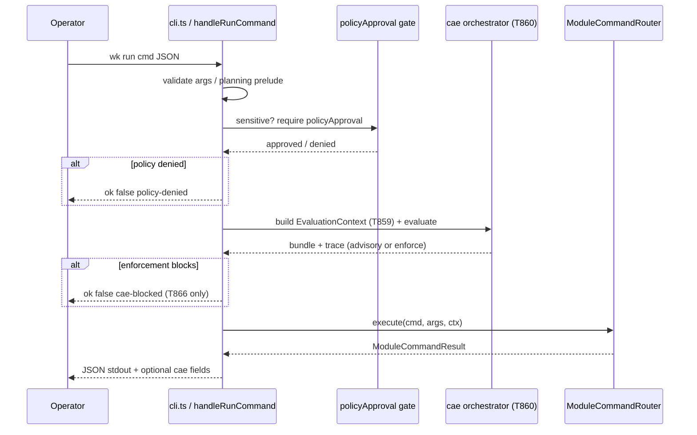

# CAE runtime integration (CLI / router)

**Task:** **`T849`**. **Program context:** **`tasks/cae/CAE-PROGRAM-CONTEXT.md`**. **Evaluation context:** **`.ai/cae/evaluation-context.md`**, **`schemas/cae/evaluation-context.v1.json`** (**`T842`**). **Failure / degradation matrix:** **`.ai/cae/failure-recovery.md`** (**`T853`**).

## Goal

Pin **where** the Context Activation Engine runs in the shipped CLI: task lifecycle vs **`wk run <module-command>`**, ordering versus **Tier A/B `policyApproval`**, merge of **task-level** and **command-level** activations, caching, and failure posture — without scattering CAE calls across modules.

## Single orchestrator

All CAE resolution for a CLI process flows through **one** orchestrator surface (planned package path: **`src/core/cae/`** — exact file names land with **T858**/**T860**/**T864**). **Forbidden:** importing CAE helpers from individual `src/modules/*` command handlers except through that orchestrator (enforced later via grep / CI guard in **T864**).

Module commands stay thin: they receive **`ModuleLifecycleContext`** and JSON results; they do **not** re-resolve registry merges or trace precedence locally.

## Hook commands and call sites (v1 target)

| Hook | When | Proposed caller | Notes |
| --- | --- | --- | --- |
| **Task context refresh** | Operator focuses a task (`run-transition` **start** / resume flows, dashboard consumers) | Task-engine command path + optional **`get-next-actions`** pipeline | Builds **task** slice of **`EvaluationContext`** when a task id is active. |
| **Command preflight (advisory)** | After argv JSON parse + pilot validation + planning prelude; **before** sensitive **`policyApproval`** gate | **`handleRunCommand`** in **`src/cli/run-command.ts`** | **Advisory-only** in v1: must not block or replace **`policyApproval`**. |
| **Command preflight (enforcement)** | Same seam as advisory; gated by config (**`T866`**) | Same | **Blocked** only when enforcement allowlist + CAE outcome says block; never weakens code invariants. |
| **Post-success observation** | After **`router.execute`** returns **`ok: true`** | **`handleRunCommand`** tail | Optional trace persistence (**`T845`**/**`T867`**); shadow observations (**`T848`**). |

**Decision (v1):** CAE **evaluation** for `wk run` targets **module commands only** (subcommand present, not the bare catalog listing). **`doctor`**, **`init`**, top-level **`config`** stay on separate policy paths first; folding them into CAE is a later opt-in (**hooks on all `wk run`** remains an open product flag in **`kit.cae.*`**).

**`traceId` on JSON stdout:** nest under a dedicated key (e.g. **`data.cae.traceId`**) in command payloads that already emit JSON, or pair **stdout JSON** with **stderr** structured diagnostics — **never** prepend non-JSON lines to a JSON-only stream (**T849 review note**).

## Ordered steps vs code today (1–9)

Mapped to **`tasks/cae/CAE-PROGRAM-CONTEXT.md`** runtime flow:

1. **Agent starts or resumes task** → task-level activation candidates loaded (or skipped when no task id).
2. **Agent invokes command** → command-level candidates loaded from activation registry.
3. **Merge task + command** → deterministic precedence (**`.ai/cae/precedence-merge.md`**, **`T860`**).
4. **Required policy / acknowledgement** → CAE **acks** are separate from **`policyApproval`** (**`.ai/cae/acknowledgement-model.md`**).
5. **Command proceeds or blocked** → **code** owns hard blocks; CAE enforcement (**`T866`**) is an additional allowlisted gate only.
6. **Trace + explanation** → **`traceId`**, **`cae-explain`** (**`T862`**).

**Concrete anchors:**

- **CLI entry:** **`src/cli.ts`** → **`handleRunCommand`** (**`src/cli/run-command.ts`**).
- **Router:** **`ModuleCommandRouter.execute`** (**`src/core/module-command-router.ts`**).
- **Lifecycle seam (existing):** **`createKitLifecycleHookBus`** **before** **`router.execute`** — CAE advisory/enforcement should mirror this ordering (policy approval resolved **before** enforce-mode hooks today; CAE **advisory** may run **after** approval is satisfied so context includes approved operation metadata, or **before** for “would require” shadow — product flag in **`T848`**).

**Recommended ordering for `wk run` (v1):**

1. Resolve registry + **`effective`** config; construct router.  
2. Validate pilot args + planning prelude.  
3. Resolve **`policyApproval`** for sensitive commands (unchanged).  
4. Auto-checkpoint hook (unchanged).  
5. **`kit` lifecycle hooks** (unchanged).  
6. **CAE:** build **`EvaluationContext`** (**`T859`**) → **evaluate** (**`T860`**) → attach **advisory** payload / **enforce** if configured.  
7. **`router.execute`**.

This keeps **“missing CAE”** from bypassing **policy-denied** semantics and matches **“never bypass code-level safety because CAE failed”** (**`T853`**).

## Merge: task-level + command-level

- **Task-level** activations: keyed by **`taskId`** + **`phaseKey`** (+ optional tags/features from allowlisted metadata).  
- **Command-level** activations: keyed by **`command.name`** (+ **`moduleId`** when known).  
- **Merge** executes in orchestrator only, emitting one **effective activation bundle** + **trace** per **`T843`**.

## Cache key spec

In-process cache (optional; off by default in tests):

**`cacheKey = hash(`** **`registryHash`** **`,`** **`contextHash`** **`,`** **`command.name`** **`,`** optional **`task.taskId`** **`)`**

| Component | Definition |
| --- | --- |
| **`registryHash`** | Stable hash of **artifact registry** + **activation definition** file contents (or merged mtime+size fingerprint if hashing full body is too heavy — prefer content hash for determinism). |
| **`contextHash`** | Canonical serialization of **`EvaluationContext`** per **`.ai/cae/evaluation-context.md`** (JCS / lexicographic JSON — same algorithm as **`bundleId`** in **T860**). |
| **`command.name`** | Normalized module command string after alias resolution. |
| **`task.taskId`** | Omitted when no active task (global commands). |

**Invalidation**

- Registry or activation files change → **`registryHash`** changes → all entries invalidate.  
- Task row or workspace status changes → **`contextHash`** changes.  
- Config toggle **`kit.cae.enabled`** or shadow/enforcement mode changes → treat as **`registryHash`** bump (fold into effective CAE config digest).

**Negative cache:** Do not cache **hard errors** that depend on transient IO without TTL; prefer **fail-open advisory** per **`T853`**.

## Performance guardrails

- **Budget:** default **≤ 25 ms** wall time for **evaluate** on warm cache (developer laptop class); **≤ 150 ms** cold (SSD) for registry load + first eval — exceed only behind explicit debug flag.  
- **Allocation:** avoid copying full task **`metadata`**; builder allowlist only (**`T859`**).  
- **Parallelism:** single-threaded eval in v1; no `Promise.all` fan-out to unbounded filesystem reads.

## Command blocked vs advisory-only (before **`T866`**)

| Mode | Behavior |
| --- | --- |
| **Advisory (default)** | CAE may attach warnings / **`caeSummary`** to payloads; **never** returns **`ok: false`** solely because CAE failed. |
| **Shadow** | Same as advisory plus **`shadowObservation`** on bundle (**`T848`**). |
| **Enforcement (`T866`)** | CAE may return **block** only for **allowlisted** commands and **never** instead of schema / policy / SQLite invariants. |

Normative failure × surface matrix: **`.ai/cae/failure-recovery.md`** (**`T853`**).

## Sequence (mermaid)

## Related files

- **`src/cli/run-command.ts`** — run pipeline and policy ordering.  
- **`src/core/module-command-router.ts`** — command dispatch.  
- **`src/core/kit-lifecycle-hooks.ts`** — precedent for pre-`execute` seams.  
- **`.ai/cae/cli-read-only.md`** — read-only inspection commands (**`T847`**).  
