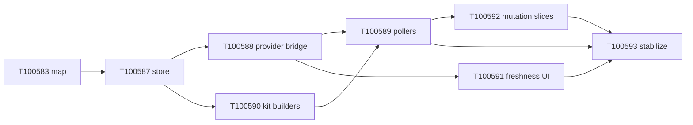

# Dashboard Option 1: State store + targeted pollers

**Status:** execution — tasks **T100583**, **T100587**–**T100593** in phase **121** (`proposed`).  
**Source:** [workflow-cannon-dashboard-data-loading-options.md](../../workflow-cannon-dashboard-data-loading-options.md) (repo root handoff).  
**Goal:** Paint shell instantly; first useful state **&lt;5s**; visible slices fresh **≤10s**; mutations never queue behind dashboard refresh reads.  
**Non-goal (Option 2):** Long-lived dashboard read service / daemon — only after Option 1 stabilizes.

**Data map:** [.ai/runbooks/dashboard-data-map.md](../runbooks/dashboard-data-map.md) — slice → source → UI, lazy buckets, config host reads.

---

## Architecture (target)

```text
Targeted pollers (single-flight per slice/group)
  → DashboardDataStore (read-side only, stale-but-visible)
    → DashboardViewProvider (render + wcSectionPatch only)
      → webview
```

Mutations stay on existing CLI/policy paths; pollers pause during `setRefreshPaused` / mutation holds.

---

## Execution queue (task engine)

| ID | Title | Depends on | Handoff steps |
| --- | --- | --- | --- |
| **T100583** | Dashboard data map (slice → source → UI) | — | Source mapping + Step 1 prep |
| **T100587** | Dashboard snapshot types, slice registry, DataStore + tests | T100583 | Steps 2–3 |
| **T100588** | Wire DashboardViewProvider to render from store snapshot | T100587 | Step 4 |
| **T100589** | DashboardPollerCoordinator (critical/queue/ops/status) | T100588 | Steps 5–6 |
| **T100590** | dashboard-summary builder split by projection | T100587 | Step 7 (kit) |
| **T100591** | Dashboard stale/fresh UI markers per section | T100588 | Step 8 |
| **T100592** | Mutation → slice invalidation + poller pause/resume | T100589 | Step 9 |
| **T100593** | Option 1 stabilize: load trace, bench gates, acceptance | T100589, T100591, T100592 | Step 10 |

---

## Task T100583 — Data map

**Type:** `workspace-kit`  
**Scope:** `.ai/runbooks/dashboard-data-map.md` (machine canon); optional maintainer render later via doc module.

**Technical scope**

- Document every dashboard field per handoff table (source command, SQLite/file, builder, UI section, freshness SLA, lazy?, invalidation).
- Cross-link `dashboard-section-registry.ts`, `dashboard-slice-registry` (once added), `dashboard-summary` projections.

**Acceptance criteria**

- Map covers all rows in handoff “Initial known map” plus extension-only reads (`list-tasks` lazy buckets, config host).
- Each row names `DashboardMutationKind` invalidation trigger.
- Published at [.ai/runbooks/dashboard-data-map.md](../runbooks/dashboard-data-map.md) and linked from this plan.

---

## Task T100587 — Store foundation

**Type:** `workspace-kit`  
**Scope:** `extensions/cursor-workflow-cannon/src/views/dashboard/`

**Technical scope**

- Add `dashboard-snapshot-types.ts`, `dashboard-slice-registry.ts`, `dashboard-data-store.ts`.
- Implement `DashboardDataStore` API from handoff (subscribe, markLoading/Stale/Error, updateSlice, isFresh, staleSlices).
- Unit tests: `dashboard-data-store.test.mjs` (change detection, last-good-on-error, planningGeneration ingest).

**Acceptance criteria**

- Store emits `DashboardSliceUpdate` only when slice value or status changes.
- Tests pass in `extensions/cursor-workflow-cannon` npm test.
- No change to webview behavior yet (store usable in isolation).

---

## Task T100588 — Provider bridge

**Type:** `workspace-kit`  
**Scope:** `DashboardViewProvider.ts`, `dashboard-refresh-controller.ts` (coordination only)

**Technical scope**

- Inject `DashboardDataStore` + stub `DashboardPollerCoordinator` (no intervals yet).
- On resolve: shell → `renderFromSnapshot({ preferCached: true })` → ingest existing `pushUpdate` / `runDashboardSummary` results into store.
- Replace direct `lastDashboardSummaryData` as sole paint source with snapshot-driven `patchSectionsFromSnapshot`.
- Preserve `runForDashboardPaint` for bootstrap until pollers land.

**Acceptance criteria**

- Dashboard still loads (no regression vs current startup direct path).
- Single `dashboard-summary` path can feed multiple slices in store.
- Existing section patch / `wcReplaceRoot` behavior unchanged for mutations.

---

## Task T100589 — Pollers

**Type:** `workspace-kit`  
**Scope:** `dashboard-pollers.ts`, `DashboardViewProvider`, `extension.ts` lifecycle

**Technical scope**

- Implement poll groups: Critical (2s: overview, phase, agent), Queue (5s: queue, ideas), Ops (10s: team, subagents, checkpoints), Status (30s or visible-only), PhaseJournal/Cae/Config per handoff.
- Single-flight per slice; respect `refreshController` generation + mutation suppression.
- `refreshCriticalNow()` on view resolve; remove or downgrade 45s global `pushNow` interval when pollers active.
- `dashboard-pollers.test.mjs`: start/stop, single-flight, pause during suppression, visible-only gating.

**Acceptance criteria**

- Critical slices refresh within **5s** on normal workspace (measured via bench or trace).
- Visible non-heavy slices within **10s**.
- Mutations do not block behind refresh reads (mutation lane / pause verified).
- No duplicate serial overview+queue startup if store can serve queue slice from QueuePoller within SLA.

---

## Task T100590 — Kit projection builders

**Type:** `workspace-kit`  
**Scope:** `src/modules/task-engine/commands/task-engine-dashboard-on-command.ts`, `dashboard-summary-projection.ts`

**Technical scope**

- Refactor `runDashboardSummaryCommand` to `buildDashboardBase` + projection-specific builders (`overview`, `queue`, `status`, `full`).
- Ensure `overview` skips queue rollup work; `queue` includes `systemStatus.phase` fields needed by overview roster OR document split read.
- Optional: add projections `critical`, `ideas`, `phase`, `agentOps`, `systemLight` if cheaper than full rebuild.
- Update `src/modules/task-engine/instructions/dashboard-summary.md` + bench script.

**Acceptance criteria**

- `pnpm run check` passes; `node scripts/bench-dashboard-refresh.mjs` shows lower ms for `overview` vs today (~3s → materially less CPU time).
- Projections remain backward compatible (`dashboardProjection` field stamped).
- Extension pollers use smallest projection per slice registry.

---

## Task T100591 — Freshness UI

**Type:** `workspace-kit`  
**Scope:** `render-dashboard-shell.ts`, `render-dashboard.ts`, webview CSS

**Technical scope**

- Per-section freshness copy: “Updated Ns ago”, “Refreshing…”, “Stale”, “Failed (showing last good)”.
- Wire from `DashboardSlice.status` + `updatedAt` in `patchSectionsFromSnapshot`.

**Acceptance criteria**

- Visible sections never imply “fresh” when slice is stale/error.
- Stale-but-visible: last good HTML remains during refresh failure.

---

## Task T100592 — Mutation ↔ slices

**Type:** `workspace-kit`  
**Scope:** `dashboard-section-invalidation.ts`, `DashboardPollerCoordinator`, drawer/mutation holds

**Technical scope**

- Map `DashboardMutationKind` → stale slices (handoff Step 9 table).
- On mutation start: pause pollers, preempt refresh, mark slices stale.
- On success: resume + `refreshSlicesNow(affected)`.
- Tests: `dashboard-targeted-invalidation.test.mjs` updates.

**Acceptance criteria**

- `task-queue` mutation stale overview, queue, phase, agent within one refresh cycle.
- Drawer workflows unchanged; planningGeneration still ingested from slice payloads.

---

## Task T100593 — Stabilize + observability

**Type:** `workspace-kit`  
**Scope:** `dashboard-load-trace.ts`, bench, tests, handoff DoD

**Technical scope**

- Optional `dashboard-load-trace.ts`: slice timing, CLI command, queue wait, preempt, stale visible.
- Document bench targets in `.ai/runbooks/` or extend `scripts/bench-dashboard-refresh.mjs` for slice SLA.
- Verify DoD: shell instant, overview &lt;5s, visible ≤10s, tests listed in handoff.

**Acceptance criteria**

- Trace answers “which slice/command was slow” from Workflow Cannon output channel.
- All handoff Option 1 acceptance tests exist and pass.
- README/plan updated: Option 2 deferred until green.

---

## Sequencing diagram



---

## CLI: tasks created

Batch helper (idempotent resume): `node scripts/create-dashboard-option1-tasks.mjs --resume-json '{"T583":"T100583","T584":"T100587"}'`.

List epic: `pnpm exec wk run list-tasks '{"phaseKey":"121","metadataFilters":{"epic":"dashboard-option-1-state-store"},"status":"proposed"}'`

Accept to **ready** when starting delivery: `run-transition` **`accept`** per task with `policyApproval` and current `expectedPlanningGeneration`.

---

## Out of scope (Option 2 preview)

- `src/services/dashboard-service/`
- `dashboard.dataSource: service | cli-polling | auto`
- localhost HTTP + SSE — see handoff Option 2 section
