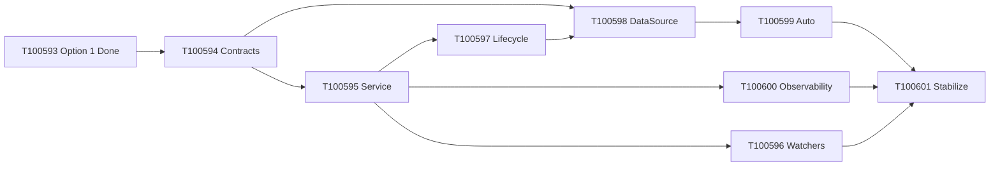

# Dashboard Option 2: Kit read service + HTTP/SSE

**Status:** execution — tasks **T100594**–**T100601** in phase **122** (`proposed`); gated on **T100593** (Option 1 stabilize).  
**Source:** [workflow-cannon-dashboard-data-loading-options.md](../../workflow-cannon-dashboard-data-loading-options.md) (Option 2 section).  
**Prerequisite plan:** [.ai/plans/dashboard-option-1-state-store-and-pollers.md](./dashboard-option-1-state-store-and-pollers.md)  
**Phase roster:** `122` — **Warm dashboard read daemon** (≤5 words).

## Architecture (target)

```text
workspace-kit dashboard service (2B, warm SQLite)
  → HTTP GET /snapshot, /slices/*, SSE /dashboard/events
    → ServiceDashboardDataSource (extension)
      → DashboardDataStore (unchanged from Option 1)
        → webview section patches
```

Mutations remain **CLI/policy only**; the service is read-side.

## Recorded decisions

| # | Topic | Choice |
| --- | --- | --- |
| 1 | Service placement | **2B** — workspace-kit service process (not extension-host) |
| 2 | Transport | **HTTP + SSE** on localhost (dynamic port in `runtime.json`) |
| 3 | Phase organization | **Phase 122** separate epic (after Option 1 stabilizes) |
| 4 | CLI surface | **`wk run`** — `dashboard-service-start`, `stop`, `status`, `snapshot` |
| 5 | Default `dashboard.dataSource` | **`auto`** at Option 2 ship (service + CLI poller fallback) |
| 6 | Internal refresh | **Watchers + tiered backup intervals** (event-driven + 1–2s / 3–5s / 10s safety nets) |

## Non-goals

- Rewriting webview or abandoning `DashboardDataStore`.
- Making the service authoritative for mutations.
- Replacing Option 1 before **T100593** acceptance tests pass.

---

## Execution queue (task engine)

| ID | Title | Depends on | Handoff steps |
| --- | --- | --- | --- |
| **T100594** | Service contracts + `dashboard.dataSource` config | T100593 | § contracts + § feature flag |
| **T100595** | Dashboard service process (HTTP routes, snapshot store) | T100594 | § Step 3 |
| **T100596** | Watchers + tiered slice refreshers | T100595 | § Service polling/watching |
| **T100597** | `wk run` dashboard-service lifecycle + runtime metadata | T100595 | § Step 4 |
| **T100598** | `ServiceDashboardDataSource` (HTTP + SSE client) | T100594, T100597 | § Step 5 |
| **T100599** | `auto` mode, health probe, CLI fallback, mode badge | T100598 | § Steps 6–7 |
| **T100600** | Service observability (health, per-slice timing) | T100595 | § Observability |
| **T100601** | Option 2 stabilize: tests, bench, DoD | T100599, T100600, T100596 | § Option 2 Done |

---

## Task T100594 — Contracts + config

**Scope:** `src/contracts/dashboard-snapshot.ts`, `src/contracts/dashboard-events.ts`; config schema for `dashboard.dataSource`: `cli-polling` | `service` | `auto` (default **`auto`** per decision 5).

**Acceptance**

- Versioned `DashboardServiceSnapshot` / `DashboardServiceEvent` types shared by kit + extension.
- Config documented in machine instructions; invalid values fail fast at service start.

---

## Task T100595 — Service process

**Scope:** `src/services/dashboard-service/` — `server.ts`, `routes.ts`, `snapshot-store.ts`, `slice-refreshers.ts`, `events.ts`.

**Acceptance**

- `GET /health`, `GET /dashboard/snapshot`, `GET /dashboard/slices/:name`, `POST /dashboard/refresh`.
- `GET /dashboard/events` SSE emits `dashboard.slice.updated` / `dashboard.snapshot.updated`.
- Read-only SQLite; no mutation bypass.

---

## Task T100596 — Watchers + intervals

**Scope:** `watchers.ts` — task store, planning SQLite, config, git task-state; backup intervals per handoff tiers.

**Acceptance**

- Critical slices event-driven or ≤2s; queue ≤5s; visible ops ≤10s.
- Manual `POST /dashboard/refresh` forces selected slices.

---

## Task T100597 — Lifecycle commands

**Scope:** `wk run dashboard-service-start|stop|status|snapshot`; `.workspace-kit/dashboard-service/runtime.json`, `service.pid`, `service.log`.

**Acceptance**

- Start binds localhost port; status returns pid, port, generation, uptime.
- Idempotent start/stop; extension can parse `runtime.json`.

---

## Task T100598 — Extension data source

**Scope:** `service-dashboard-data-source.ts`; `DashboardDataSource` implementation using HTTP + SSE.

**Acceptance**

- `start()` / `stop()` / `refreshSlice()` / `getSnapshot()` / `subscribe()` wired to store.
- Warm snapshot &lt;1s; respects `planningGeneration` ingest.

---

## Task T100599 — Auto mode + fallback

**Scope:** `extension.ts`, config resolution, commands “Restart Dashboard Service” / “Use CLI Dashboard Refresh Mode”.

**Acceptance**

- **`auto`**: health check → service; else `CliPollingDashboardDataSource`.
- Mode badge in dashboard; no silent failure (stale + last-good preserved).

---

## Task T100600 — Observability

**Scope:** `/health` extended metrics: uptime, last refresh per slice, errors, avg duration, generation, `planningGeneration`.

**Acceptance**

- Output channel or trace answers “which slice failed” without spawning CLI.

---

## Task T100601 — Stabilize

**Scope:** Tests (`dashboard-service*.test`, extension integration); bench vs Option 2 acceptance criteria.

**Acceptance**

- Cold start + first snapshot &lt;5s; warm &lt;1s; critical ≤2s; visible ≤10s.
- No repeated CLI spawn during normal `auto` operation.
- Fallback to Option 1 pollers verified when service down.

---

## Sequencing



---

## CLI

Tasks created via `scripts/create-dashboard-option2-tasks.mjs`. Decision metadata stored on each task under `metadata.option2Decisions`.

List epic:

```bash
pnpm exec wk run list-tasks '{"phaseKey":"122","metadataFilters":{"epic":"dashboard-option-2-read-service"}}'
```
