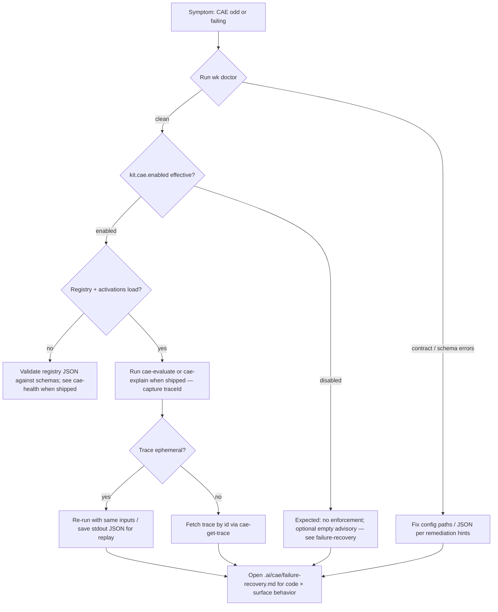

# Runbook: debug CAE (Context Activation Engine)

**Task:** **`T855`**. **Audience:** operators and agents (machine canon under **`.ai/`**).

## When to use this

- **`cae-*`** commands return **`ok: false`** or unexpected empty **`data`**.  
- Doctor reports CAE / registry issues.  
- Shadow observations disagree with expected activations.

## Flowchart

## Ordered checks

1. **`pnpm run wk doctor`** — contract files, planning DB, optional CAE summary lines when implemented.  
2. **Registry path** — artifact registry file on disk (see **`registry/cae/artifacts.v1.json`** or **`.ai/cae/registry/artifacts.v1.json`** per **`T857`**).  
3. **Read-only commands** — **`cae-list-artifacts`**, **`cae-health`**, **`cae-evaluate`** (**`T861`**, **`T862`**) with **`pnpm exec wk run …`** for clean JSON stdout.  
4. **Remediation catalog** — structured failures may include **`remediation.instructionPath`**; align with **`src/core/cli-remediation.js`** patterns.

## Shadow interpretation

Shadow mode labels **would** activate / enforce without changing outcomes — see **`.ai/cae/shadow-mode.md`**. Do not treat shadow output as enforcement.

## Doc routing

Keep routine automation on **`.ai/**`** paths; do not depend on **`docs/maintainers/`** prose for execution (**`.cursor/rules/agent-doc-routing.mdc`**).
