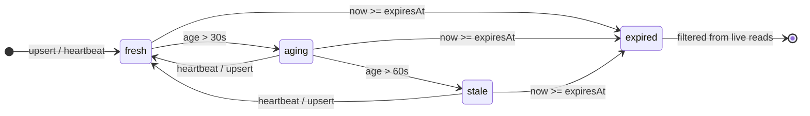

# AGENT_ORCHESTRATION_ACTIVITY.md

**Artifact:** A-ACTIVITY (Activity v1 lifecycle spec)  
**WBS:** WBS-AO-070 / task **T100630**  
**Requires:** [AGENT_ORCHESTRATION_FOUNDATION.md](./AGENT_ORCHESTRATION_FOUNDATION.md) §7–8, [AGENT_ORCHESTRATION_CONTRACTS.md](./AGENT_ORCHESTRATION_CONTRACTS.md) §6 (A-SCHEMA), [AGENT_ORCHESTRATION_POLICY.md](./AGENT_ORCHESTRATION_POLICY.md) §3.4 (A-POLICY), [AGENT_ORCHESTRATION_COMMANDS.md](./AGENT_ORCHESTRATION_COMMANDS.md) §9 (A-COMMANDS)  
**Blocks:** A-PROJECTION (T100631 / T-AO-080), T-AO-430 (activity command extensions), T-AO-610 (dashboard projection), T-AO-520 (Task Work Agent prompt)  
**Produced:** 2026-05-31  
**Status:** Draft for human approval — lifecycle derivation in read paths and TTL default alignment remain implementation targets until sign-off below.

---

## 1. Executive summary

Activity v1 is a **TTL-governed live status lease** stored in `kit_agent_activity_leases`. It answers one question only:

```text
What is this agent doing right now?
```

It is **not** assignment scope, handoff evidence, or task lifecycle state.

| Layer | Question | Source of truth |
| --- | --- | --- |
| **Assignment** | What does this agent owe? | `kit_team_assignments` row + metadata |
| **Handoff** | What happened and what proves it? | `kit_team_assignments.handoff` (v1/v2) |
| **Activity** | What is happening right now? | `kit_agent_activity_leases` (ephemeral lease) |

```text
Worker on assignment
        ↓
set-agent-activity (upsert lease + TTL)
        ↓
heartbeat every 30s (refresh updatedAt / expiresAt)
        ↓
dashboard-summary / get-orchestration-status (read path derives fresh/aging/stale/expired)
        ↓
clear-agent-activity OR natural TTL expiry when work ends
```

**Normative shape:** foundation §7–8; field tables and enums: contracts §6; JSON Schema: `schemas/agent-orchestration/agent-activity.v1.json`; mutation authority: policy §3.4; command argv: commands §9.

---

## 2. Source-of-truth boundaries (mandatory)

### 2.1 Activity is live-state only

| Use activity for | Do **not** use activity for |
| --- | --- |
| Dashboard “what’s happening now” | Whether an assignment is `assigned`, `submitted`, or `reconciled` |
| Orchestrator situational awareness | Handoff acceptance or reconcile decisions |
| Stale-worker detection (with TTL rules) | Task `status` (`ready`, `in_progress`, `complete`) |
| High-signal step labels during delivery | Assignment ownership or scope changes |

**Invariant:** If activity and assignment/handoff/task rows disagree, **assignment + handoff + task store win** for durable decisions. Activity is **hint + visibility**, never authoritative evidence.

### 2.2 Relationship to AgentSession pointers

`AgentSession.currentActivityId` is a **pointer** to the active lease id (convention: `current:<agentId>:<sessionId>`). The session row does **not** embed TTL or lifecycle — those live on the lease row (contracts §4, architecture three-layer map).

### 2.3 Read vs write responsibilities

| Path | Responsibility |
| --- | --- |
| **Write** (`set-agent-activity`, `clear-agent-activity`) | Persist lease fields; compute `expiresAt` from `ttlSeconds`; upsert by `activityId` |
| **Read** (`dashboard-summary`, proposed `get-orchestration-status`, A-PROJECTION) | Derive `lifecycle` (`fresh` / `aging` / `stale` / `expired`); merge with derived status when no live lease |

Write paths **must not** require callers to pass `lifecycle` — it is always computed at read time from `updatedAt`, `expiresAt`, and wall clock (commands §9.3).

---

## 3. Field contract (Activity v1)

Canonical tables: **AGENT_ORCHESTRATION_CONTRACTS.md** §6. Summary below for lifecycle operators.

### 3.1 Required fields (every lease)

| Field | Type | Notes |
| --- | --- | --- |
| `activityId` | string | Opaque id; default `current:<agentId>:<sessionId>` |
| `agentId` | string | Agent **instance** id (not definition id) |
| `sessionId` | string | Subagent session scope |
| `kind` | enum | §4 — must match `DASHBOARD_AGENT_STATUS_KINDS` |
| `label` | string | Human-readable one-liner for dashboard |
| `updatedAt` | ISO-8601 | Last upsert or heartbeat |
| `expiresAt` | ISO-8601 | `updatedAt + ttlSeconds` (default TTL §5) |

### 3.2 Required when applicable

| Field | When required |
| --- | --- |
| `agentDefinitionId` | Role/profile known (worker on registered definition) |
| `assignmentId` | Worker reporting activity while on an assignment |
| `taskId` | Task-bound work (`T###` pattern) |
| `phaseKey` | Phase-scoped delivery |
| `hostHint` | Host environment known (`cursor`, `claude-code`, etc.) |
| `modelTier` | Model routing recorded |

### 3.3 Optional fields

| Field | Purpose |
| --- | --- |
| `currentStep` | Finer-grained step within `label` |
| `command` | Last or current kit/shell command driving the step |
| `modelHint` | Specific model slug when useful |
| `startedAt` | First upsert time (preserved across heartbeats) |
| `details` | Extension bag (`additionalProperties: true` in schema) |

**Storage note:** Today `agent-activity-store.ts` also persists `prNumber`, `version` on the SQLite row — treat as v1 dashboard hints; they map to projection fields in A-PROJECTION.

### 3.4 Golden example

Fixture: `fixtures/agent-orchestration/agent-activity-working-task.v1.json`

---

## 4. Activity kinds (`kind`)

Source enum: contracts §2.8; implementation: `src/modules/task-engine/agent-activity-store.ts` (`DASHBOARD_AGENT_STATUS_KINDS`).

| Kind | Typical actor | When to set | Dashboard signal |
| --- | --- | --- | --- |
| `unavailable` | any | Agent offline or not participating | Gray / absent |
| `planning` | orchestrator | Queue triage, assignment design | Thinking / planning |
| `blocked` | worker | After `report-assignment-blocked` (policy §5.1 step 3) | Needs attention |
| `working_task` | worker | Active implementation on assignment | In progress |
| `delegating_task` | orchestrator | Spawning or messaging worker | Coordinating |
| `ready_task` | worker | Picked up work, not yet coding | Starting |
| `awaiting_instruction` | worker | Waiting for orchestrator/human | Idle-wait |
| `reviewing_item` | any | Improvement/review queue item | Review |
| `reviewing_pr` | any | PR review (pass `prNumber` or `details.prUrl`) | Review |
| `validating` | worker | Checks, tests, parity | Validating |
| `releasing` | any | Release/phase closeout steps | Releasing |
| `awaiting_policy_approval` | any | Tier A/B gate pending | Policy gate |
| `awaiting_human_gate` | any | Explicit human sign-off | Human gate |

**Validation:** Unknown `kind` → reject write (`normalizeAgentActivityKind` returns null → `invalid-run-args` class failure).

**Kind vs lifecycle:** `kind` describes **work mode**; `lifecycle` (§6) describes **freshness of the lease**. A `blocked` activity can be `fresh` or `stale` independently.

---

## 5. Heartbeat and TTL

### 5.1 Timing constants (v1 normative)

| Constant | Value | Notes |
| --- | --- | --- |
| **Recommended heartbeat interval** | 30 seconds | Agents SHOULD refresh during long-running steps |
| **Default TTL (`ttlSeconds`)** | 90 seconds | Target per A-SCHEMA; aligns with 3× heartbeat |
| **Minimum TTL** | 30 seconds | Command clamp (commands §9.1) |
| **Maximum TTL** | 3600 seconds | Command clamp |
| **Implementation gap** | Today default 600s in `set-agent-activity` instruction | WP-3 / T-AO-430 aligns default to 90s |

### 5.2 Write-path TTL computation

```text
expiresAt = updatedAt + ttlSeconds   (ISO-8601, UTC)
```

On every `set-agent-activity` upsert:

- `updatedAt` ← caller `now` (server clock)
- `expiresAt` ← recomputed from `ttlSeconds`
- `startedAt` ← preserved from existing row if same `activityId`, else `now`

**Heartbeat:** Re-upserting the same `activityId` with unchanged semantic fields **or** calling internal `heartbeatAgentActivityLease` refreshes `updatedAt` and `expiresAt` without changing `kind`/`label`. Agents SHOULD heartbeat at least every 30s during continuous work.

### 5.3 Agent compliance (normative)

| Rule | Owner |
| --- | --- |
| Set activity when assignment work begins | Task Work Agent |
| Update `kind`/`label`/`currentStep` on meaningful step changes | Task Work Agent |
| Heartbeat every ≤30s during long commands (build, test, review wait) | Task Work Agent |
| Set `blocked` after blocker flow (policy §5.1) | Task Work Agent |
| Clear activity when assignment terminal or session closes | Task Work Agent (or orchestrator on behalf) |
| Do not use activity to imply handoff submitted or assignment reconciled | All agents |

Orchestrator **may** set activity on its own `agentId` (e.g. `planning`, `delegating_task`). Worker **may only** mutate own `agentId` (policy §3.4).

---

## 6. Lifecycle states (`fresh` / `aging` / `stale` / `expired`)

Lifecycle is a **read-path projection** over a non-expired lease. It is **not stored** on the lease row.

### 6.1 Definitions (unambiguous)

Let:

- `now` = reader wall clock (UTC)
- `ageMs` = `now - parse(updatedAt)`
- `expired` = `now >= parse(expiresAt)`

| Lifecycle | Predicate (all UTC) | Meaning for operators |
| --- | --- | --- |
| **`expired`** | `now >= expiresAt` | Lease dead; treat as **no live activity** |
| **`stale`** | `NOT expired` AND `ageMs > 60_000` | Worker likely stopped heartbeating; investigate |
| **`aging`** | `NOT expired` AND `30_000 < ageMs <= 60_000` | Heartbeat due soon; still plausible |
| **`fresh`** | `NOT expired` AND `ageMs <= 30_000` | Live signal; high confidence |

**Boundary rules (exclusive upper bounds):**

```text
fresh:   ageMs <= 30s
aging:   30s < ageMs <= 60s
stale:   60s < ageMs AND NOT expired
expired: now >= expiresAt
```

At exactly `ageMs = 30s` → **fresh**. At exactly `ageMs = 60s` → **aging**. At `ageMs = 60s + 1ms` → **stale**.

### 6.2 Lifecycle diagram



### 6.3 Read-path filtering vs labeling

| Operation | Behavior |
| --- | --- |
| `listCurrentAgentActivityLeases` | Returns rows where `expiresAt > now` only — **expired rows omitted entirely** |
| Dashboard `agentStatus` | Maps surviving lease → `DashboardAgentStatusSummary` + **`lifecycle`** field (A-PROJECTION / T100631) |
| No non-expired lease | Fall back to **derived** status from task/assignment/session (`liveActivity ?? derived`) |

**Important:** `stale` leases **remain visible** until `expiresAt`. Operators see “last known step” with degraded confidence — not silent disappearance at 60s.

### 6.4 Confidence mapping (for A-PROJECTION)

| Lifecycle | Suggested `confidence` |
| --- | --- |
| `fresh` | `high` |
| `aging` | `medium` |
| `stale` | `low` |
| `expired` | N/A (lease excluded) |

---

## 7. Clear vs expire

These are **distinct** outcomes; conflating them breaks dashboard semantics.

| Mechanism | Trigger | Storage effect | Dashboard effect |
| --- | --- | --- | --- |
| **Expire** | `now >= expiresAt` without heartbeat | Row **may remain** in SQLite; filtered by live reads | Live activity **absent**; derived status may apply |
| **Clear** | `clear-agent-activity` with filter | Row **deleted** (`DELETE FROM kit_agent_activity_leases`) | Live activity **absent** immediately |
| **Upsert replace** | New `activityId` or changed lease | Previous row for same id updated in place | New live signal |

### 7.1 When to clear (normative)

Agents **SHOULD** `clear-agent-activity` when:

- Assignment reconciled or cancelled
- Session closed
- Worker enters terminal handoff state and stops work
- Orchestrator explicitly releases worker visibility

Agents **MAY** rely on **expire alone** only for benign idle transitions (short terminal label then TTL) — prefer explicit clear before handoff reconcile.

### 7.2 When expire happens without clear

If a worker crashes without clearing:

1. Lease becomes `stale` after 60s without heartbeat
2. Lease becomes `expired` at `expiresAt` (default 90s after last write)
3. Live reads stop returning it — dashboard falls back to derived status
4. **Stale row in DB is not assignment evidence** — orchestrator uses assignment + handoff for truth

### 7.3 clear-agent-activity argv

```bash
pnpm exec wk run clear-agent-activity '{
  "agentId": "phase-126-delivery-worker",
  "sessionId": "default"
}'
```

Requires at least one filter: `activityId`, `agentId`, or `sessionId` (commands §9.2). Clears are **best-effort** for side-effect callers per instruction docs.

---

## 8. End-to-end lifecycle events

Normative v1 sequence (extends foundation §8):

```text
1. register-assignment + spawn-subagent
2. update-subagent-session { currentAssignmentId, currentActivityId }  (orchestrator)
3. set-agent-activity { kind: "ready_task" | "working_task", assignmentId, taskId, ... }
4. [loop] step change → set-agent-activity (update label/kind/command)
4b. [loop] long step → heartbeat / re-upsert every ≤30s
5. blocked path → set-agent-activity { kind: "blocked" } + report-assignment-blocked
6. validating → set-agent-activity { kind: "validating", command: "pnpm run check" }
7. handoff → submit-assignment-handoff (durable evidence) + optional short terminal activity
8. clear-agent-activity OR allow TTL expire after terminal label
9. reconcile-assignment (orchestrator) — assignment truth; activity already cleared/expired
```

**Dashboard visibility goal:** Steps 3–7 produce continuous, TTL-bounded signal so `dashboard-summary` can render agent cards without polling transcripts.

---

## 9. Future command-boundary hook candidates

v1 requires **explicit** agent calls to `set-agent-activity`. A later phase (foundation §8 “Future Work”, WP-3+) **MAY** auto-emit activity at kit command boundaries.

| Hook point | Suggested `kind` | Auto? | Notes |
| --- | --- | --- | --- |
| `register-assignment` accepted | `ready_task` | orchestrator-side | Links `assignmentId` |
| `run-transition` `start` | `working_task` | worker-side | Label from task title |
| `run-transition` `complete` | `validating` → clear | worker-side | Short terminal validate |
| `pnpm run check` / parity / test wrappers | `validating` | optional middleware | Pass `command` |
| PR review commands / `wait-for-pr-checks` | `reviewing_pr` | optional | Pass `prNumber` |
| `block-assignment` / `report-assignment-blocked` | `blocked` | worker/orchestrator | Must not skip blocker reporting |
| `submit-assignment-handoff` | terminal label | worker-side | Handoff remains SoT |
| `reconcile-assignment` / `cancel-assignment` | clear | orchestrator-side | Clear worker lease |
| `close-subagent-session` | clear | either | Session pointer nulled |
| Tier A/B policy gates | `awaiting_policy_approval` | side-effect | Match `policyOperationId` |
| Human sign-off waits | `awaiting_human_gate` | side-effect | Dashboard drawer |

**Design constraints for hooks:**

- Hooks **must not** write assignment or handoff fields
- Hooks **must** be best-effort (failures do not block underlying command)
- Hooks **must** respect policy §3.4 (`agentId` scope)
- Default TTL for auto-hooks: 90s unless command is long-running (then extend via `ttlSeconds`)

---

## 10. Dashboard visibility contract (v1 minimum)

Until A-PROJECTION (T100631) ships, consumers SHOULD implement:

| Projection field | Source |
| --- | --- |
| `kind`, `label`, `taskId`, `phaseKey`, `command` | Live lease row |
| `lifecycle` | §6 formulas on read |
| `confidence` | §6.4 mapping |
| `source` | `"live_activity"` when lease non-expired; else `"derived"` |
| `updatedAt` | Lease `updatedAt` |

**No dashboard mutation:** Dashboard clicks do **not** change leases (policy P-CMD-08). Terminal agents and dashboard share the same kit validation.

Multi-agent merge (orchestrator + workers) deferred to A-PROJECTION — today `agentStatus = liveActivity ?? derived` (single lease) per commands §10.

---

## 11. Verification and human approval

### 11.1 Acceptance mapping (T100630 / A-ACTIVITY)

| Criterion | Section |
| --- | --- |
| Lifecycle supports dashboard visibility goal | §1, §8, §10 |
| Activity remains live-state, not assignment/handoff source of truth | §2 |
| Stale/expired rules are unambiguous | §6.1, §6.2 |
| Verification evidence + operator sign-off | §11.2–11.3 |

### 11.2 Operator review sign-off (required)

| Field | Value |
| --- | --- |
| Artifact | A-ACTIVITY / `AGENT_ORCHESTRATION_ACTIVITY.md` |
| Reviewer | _pending_ |
| Decision | ☐ Approve as written &nbsp; ☐ Approve with notes &nbsp; ☐ Reject — revise |
| Notes | |
| Date | |

Dependent tasks (**T100631**, **T-AO-430**, **T-AO-610**, **T-AO-520**) should treat lifecycle derivation, default TTL alignment, and command-boundary hooks as **draft** until the table above records approval.

### 11.3 Verification evidence (automated / agent)

| Check | Result |
| --- | --- |
| Aligns with foundation §7–8 activity contract and timing | §3–§6 |
| Aligns with contracts §6 field tables and §2.8 kinds | §3, §4 |
| Aligns with A-POLICY §3.4 mutation authority | §2, §5.3, §7 |
| Aligns with A-COMMANDS §9 write/read split | §2.3, §6, §9 |
| Lifecycle diagram included | §6.2 |
| Timing table reviewed (heartbeat 30s, TTL 90s, thresholds) | §5.1, §6.1 |
| Clear vs expire behavior documented | §7 |
| Command-boundary hook candidates listed | §9 |
| Golden fixture referenced | §3.4 |
| JSON Schema at `schemas/agent-orchestration/agent-activity.v1.json` | §3 |
| Phase 126 task manifest intact (12 tasks, planRef unchanged) | Verified — see §11.4 |
| `pnpm run check` (repo gate) | Pass — exit 0 on 2026-05-31 (feature/T100630-orchestration-activity) |

### 11.4 Phase 126 manifest spot-check

Verified via `workspace-kit run list-tasks '{"phaseKey":"126","limit":20}'` on delivery branch — **12 tasks**, shared `metadata.planRef: plan-artifact:1b4555aa-842a-439e-8ab5-6911df648c16`, WBS ids AO-020 through AO-090 present. No plan-artifact or task-batch edits in this deliverable.

---

## 12. Related artifacts

| Doc / path | Role |
| --- | --- |
| [AGENT_ORCHESTRATION_FOUNDATION.md](./AGENT_ORCHESTRATION_FOUNDATION.md) | Normative product intent (§7–8 Activity) |
| [AGENT_ORCHESTRATION_CONTRACTS.md](./AGENT_ORCHESTRATION_CONTRACTS.md) | Field tables, enums (§6) |
| [AGENT_ORCHESTRATION_POLICY.md](./AGENT_ORCHESTRATION_POLICY.md) | Mutation authority (§3.4) |
| [AGENT_ORCHESTRATION_COMMANDS.md](./AGENT_ORCHESTRATION_COMMANDS.md) | Command argv (§9) |
| [AGENT_ORCHESTRATION_TASKS.md](./AGENT_ORCHESTRATION_TASKS.md) | WBS T-AO-070 and downstream |
| `schemas/agent-orchestration/agent-activity.v1.json` | JSON Schema |
| `fixtures/agent-orchestration/agent-activity-working-task.v1.json` | Golden example |
| `src/modules/task-engine/agent-activity-store.ts` | Storage + kind enum |
| `src/modules/task-engine/agent-activity-recorder.ts` | TTL + label helpers |
| `src/modules/task-engine/instructions/set-agent-activity.md` | Operator instruction |

---

## 13. Document history

| Date | Change |
| --- | --- |
| 2026-05-31 | Initial A-ACTIVITY for Phase 126 / T100630 |
