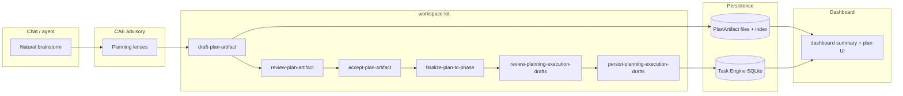

# Planner architecture — PlanArtifact v1

**Artifact:** `PLANNER_ARCHITECTURE.md` (repo root)  
**Status:** Draft for human review (**A-ARCH**)  
**Product direction:** [`PLANNER.md`](./PLANNER.md)  
**Implementation WBS:** [`PLANNER_TASKS.md`](./PLANNER_TASKS.md)  
**Inventory baseline:** [`PLANNER_TASKS.md`](./PLANNER_TASKS.md) → **A-INV**, **Baseline health snapshot**

This document records **how** Workflow Cannon will implement first-class planning (PlanArtifact v1). It does not redefine product intent; it binds modules, storage, commands, and integration boundaries so implementers can proceed after **A-ARCH** approval.

---

## 1. Source-of-truth hierarchy (locked)

```text
PlanArtifact v1     = design intent, approved scope, WBS, task-generation source
Task Engine         = execution truth (lifecycle, phase, dependencies, evidence)
Dashboard (extension) = human operating surface (calls kit commands only)
CAE                 = adaptive guidance and planning lenses (advisory)
Markdown / rendered views = non-authoritative projections of structured data
```

**Non-goals for this architecture:**

- Replace Task Engine or duplicate execution lifecycle in the planning module.
- Put planning state machines or business rules in the Cursor extension.
- Treat chat transcripts or markdown files as the canonical plan store.
- Remove `build-plan` in v1 (compatibility bridge remains; see §8).

---

## 2. Module map and ownership

| Layer | Path | Owns | Does not own |
| --- | --- | --- | --- |
| **Planning module (CLI)** | `src/modules/planning/` | `build-plan`, future `draft-plan-artifact` / `review-plan-artifact` / `accept-plan-artifact` / `finalize-plan-to-phase`; interview/question engine; wishlist-shaped artifact composition from answers | Task rows, transitions, PR evidence, plan persistence policy enforcement in UI |
| **Core planning facades** | `src/core/planning/` | Stable imports for `openPlanningStores`, build-plan session snapshot, shared types used by planning + task-engine | Command handlers (stay in modules) |
| **Task engine** | `src/modules/task-engine/` | `persist-planning-execution-drafts`, `review-planning-execution-drafts`, task store, planning generation, `dashboard-summary` projection | PlanArtifact schema validation (delegates to planning/core after WP-1) |
| **CAE** | `.ai/cae/` | Planning lens artifacts, activations for planning commands/sessions | Persisting plans or tasks |
| **Dashboard extension** | `extensions/cursor-workflow-cannon/src/views/dashboard/` | Render kit JSON, policy drawer, plan lifecycle UI (WP-7) | Plan review logic, WBS normalization, SQLite writes |

**Import rule:** Other modules use **`src/core/planning/`** for store access, not deep `task-engine/persistence/*` paths (existing REF-004 / module-build policy).

---

## 3. Storage decision — PlanArtifact v1

### 3.1 Recommendation (v1)

| Concern | Decision |
| --- | --- |
| **Canonical payload** | Versioned **JSON files** under `.workspace-kit/planning/plan-artifacts/{planId}/artifact.v{version}.json` (gitignored workspace path). |
| **Pointer / summary index** | **Module-state SQLite** row(s) in the planning DB (same `UnifiedStateDb` family as `build-plan` session), module id pattern `planning-plan-artifact:{planId}` holding current version, status, `planRef`, redacted summary for dashboard. |
| **Rendered markdown** | Generated on read via `renderPlanArtifactMarkdown()` (WP-1.5); never the write path for mutations. |

### 3.2 Rationale

- **Filesystem JSON** keeps large structured documents diffable, inspectable by agents, and easy to back up without bloating relational task tables.
- **SQLite index** reuses existing `persistModuleStateRow` / `readBuildPlanSession` patterns (`src/core/planning/build-plan-session-file.ts`) for fast `dashboard-summary` reads without loading full WBS on every poll.
- **Task Engine SQLite** (`.workspace-kit/tasks/workspace-kit.db`) remains **execution-only**; generated tasks link back via `metadata.planRef`, `metadata.planningProvenance.wbsPath`, etc.

### 3.3 Versioning and identity

- `planId`: stable UUID or slug assigned at first `draft-plan-artifact` persist.
- `version`: monotonic integer per `planId`; mutations create `artifact.v{n+1}.json`; accept pins `approvalRecord.approvedVersion`.
- `planRef`: stable string reference propagated to task metadata (existing pattern: `planning:{type}:{iso}` from `build-plan`).

### 3.4 Deferred alternatives (documented, not v1)

| Alternative | Why deferred |
| --- | --- |
| Single SQLite BLOB column per plan | Harder for operators/agents to inspect; couples large JSON to task DB migrations. |
| Repo-committed plan files | Wrong trust boundary for operator drafts; workspace-kit paths are workspace-local. |

---

## 4. Command pipeline

### 4.1 Target commands (new)

```bash
pnpm exec wk run draft-plan-artifact '<json>'
pnpm exec wk run review-plan-artifact '<json>'
pnpm exec wk run accept-plan-artifact '<json>'
pnpm exec wk run finalize-plan-to-phase '<json>'
```

Contract details (**A-CONTRACTS** / `PLANNER_COMMANDS.md`) are specified separately; architecture constraints:

| Command | Mutates plan store | Mutates task store | Policy tier |
| --- | --- | --- | --- |
| `draft-plan-artifact` | Yes (new version) | No | B (when persist) |
| `review-plan-artifact` | No (findings only) | No | C |
| `accept-plan-artifact` | Yes (`approvalRecord`) | No | B |
| `finalize-plan-to-phase` | Yes (finalize metadata) | Yes (via delegate) | B |

### 4.2 Flow diagram



### 4.3 Validation boundaries

- **Shape / schema:** `draft-plan-artifact` and storage layer (JSON Schema + TypeScript types per **A-SCHEMA**).
- **Quality / completeness:** `review-plan-artifact` engine per **A-RUBRIC** (blockers vs warnings).
- **Human gate:** `accept-plan-artifact` requires explicit `approvalRecord` (no chat-only accept).
- **Execution readiness:** `finalize-plan-to-phase` dry-run calls task-draft review equivalent before `persist-planning-execution-drafts`.

---

## 5. Task-engine reuse (no reimplementation)

| Existing capability | Role in PlanArtifact flow |
| --- | --- |
| `review-planning-execution-drafts` | Batch review profile for normalized WBS → task rows (`ux-cae-pre-persist-v1` or successor); invoked from finalize dry-run. |
| `persist-planning-execution-drafts` | Transactional multi-task create with `planRef`, `targetPhaseKey`, `desiredStatus`, idempotency — **the only persist path** for generated execution tasks. |
| `build-plan` (`outputMode: tasks`, `executionTaskDrafts`) | Compatibility preview path; previews drafts then directs operators to `persist-planning-execution-drafts`. |
| Planning generation policy | All mutators pass `expectedPlanningGeneration` when `tasks.planningGenerationPolicy` is `require`. |

**Normalizer placement:** `normalizeWbsItemToTaskDraft()` lives in `src/core/planning/` (WP-1.3 stub → WP-6.3 implementation), producing convert-wishlist-compatible rows consumed by task-engine commands.

---

## 6. Dashboard data flow

```text
Extension webview
  → CommandClient.run('dashboard-summary', …)
  → task-engine projection (dashboard-summary-projection.ts)
      ├── planningSession (build-plan interview snapshot, redacted)
      └── planArtifact (NEW: summary block per A-UX / T-7.1)
  → render-dashboard.ts panels (read-only + gated actions)
  → policy drawer → wk run accept-plan-artifact | finalize-plan-to-phase (JSON policyApproval)
```

**Rules:**

- Dashboard **never** writes plan files or task SQLite directly.
- Plan lifecycle actions are thin wrappers over the same commands agents use in CI/terminal.
- `planningSession` remains for `build-plan` resume until **A-COMPAT** retires primary UX (v1: both surfaces may appear).

**`dashboard-summary.planArtifact` (planned fields):** `planId`, `version`, `status` (draft \| reviewed \| accepted \| finalized), `reviewSummary`, `openQuestionCount`, `wbsCount`, `phaseRecommendation`, `approvalState`, `sizingFindingCount` — exact schema in **A-SCHEMA** + T-7.1.

---

## 7. CAE integration

- Planning lenses ship as CAE artifacts (**A-CAE**); activations bind to `draft-plan-artifact` and dashboard planning context (WP-2).
- CAE is **advisory only** — review blockers are deterministic code in `review-plan-artifact`, not CAE shadow output alone.
- Runbook: `.ai/runbooks/plan-artifact-workflow.md` (T-2.4) links agent CLI map snippets.

---

## 8. Compatibility (high level — full note in T-A.7 / A-COMPAT)

| Legacy path | v1 behavior |
| --- | --- |
| `build-plan` interview | Remains; session snapshot in module-state + sidecar migration path. |
| Wishlist finalize from `build-plan` | Still creates wishlist intake rows when configured. |
| Multi-task decomposition preview | Still returns `taskOutputs` for `persist-planning-execution-drafts`. |
| Dashboard planning wizard | Continues to drive `build-plan`; parallel PlanArtifact panels added (WP-7). |

**Preferred path for serious plans:** draft → review → accept → finalize (PlanArtifact pipeline). README and dashboard copy should state this without breaking existing scripts.

---

## 9. Security and policy

- Tier **B** `policyApproval` on persist accept/finalize and plan writes (see **A-POLICY** in `PLANNER_COMMANDS.md`).
- No secrets in plan artifacts; phase journal / plan notes follow existing redaction discipline.
- Plans are workspace-local; not published to npm or maintainer docs by default.

---

## 10. Risks and mitigations

| Risk | Mitigation |
| --- | --- |
| Dual planning UX (`build-plan` vs PlanArtifact) confuses operators | **A-COMPAT** + dashboard copy; single `planRef` provenance on generated tasks. |
| Large WBS payloads slow dashboard | Summary index in SQLite; full artifact loaded on demand in plan panel. |
| Artifact / task drift after finalize | Provenance on every generated row; stretch drift report (T-8.3). |
| Over-planning / huge artifacts | Conditional sections in schema; rubric profiles by plan size (**A-RUBRIC**). |
| Workspace store corruption blocks `wk doctor` | Tracked separately in baseline (**T100438**); repair before phase closeout if policy requires. |

---

## 11. Open questions (resolve in A-SCHEMA / A-CONTRACTS review)

1. **`taskGenerationPayloads[]` top-level vs per-WBS `generatedTaskPayload`** — pick one shape in **A-SCHEMA**; normalizer implements chosen model.
2. **Strict vs warn** on `accept` when `review-plan-artifact` has warnings but no blockers — default: block on blockers only; optional strict flag in accept argv.
3. **Plan list/discovery** — v1 single active draft per workspace vs many plans keyed by feature id (recommend: many plans, dashboard shows most recent + pinned).
4. **Cross-workspace plan portability** — out of scope v1; export/import deferred.

---

## 12. Implementation sequencing (after A-ARCH approval)

1. **A-SCHEMA** + **A-CONTRACTS** + **A-RUBRIC** (parallel with **A-UX** mockups).
2. WP-1 types, JSON schema, storage layer, markdown render.
3. WP-3–6 commands + task-engine delegation.
4. WP-7 dashboard surfaces (requires **A-UX** approval).
5. WP-8 E2E + CI gate.

**Human approval:** Record approver, date, and path in task metadata or PR when **A-ARCH** is accepted.

---

## 13. References

| Resource | Purpose |
| --- | --- |
| [`PLANNER.md`](./PLANNER.md) | Product direction |
| [`PLANNER_TASKS.md`](./PLANNER_TASKS.md) | WBS, A-* artifacts, baseline |
| `src/modules/planning/README.md` | Current module scope |
| `src/modules/task-engine/instructions/persist-planning-execution-drafts.md` | Task batch persist |
| `src/core/planning/build-plan-session-file.ts` | Session snapshot pattern to mirror for plan index |
| `.ai/AGENT-CLI-MAP.md` | Agent command tiers |
