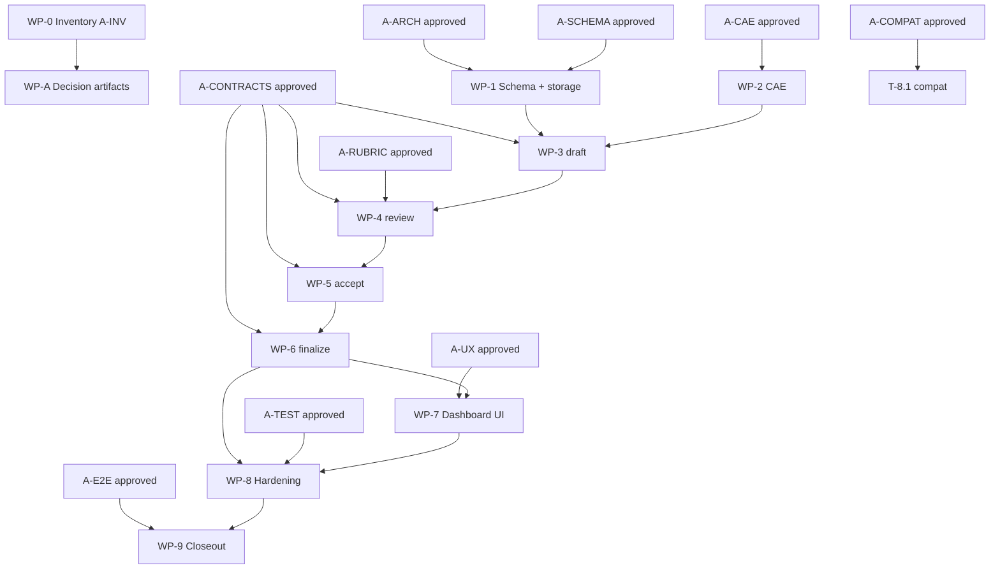

# Planner — Plan Artifact v1 implementation WBS

**Artifact:** `PLANNER_TASKS.md` (repo root).

| Document | Role |
| --- | --- |
| [`PLANNER.md`](./PLANNER.md) | **Product direction** — what Workflow Cannon planning should become |
| **`PLANNER_TASKS.md`** (this file) | **Implementation WBS** — how we build it, including human-reviewed docs/mockups before dependent code |

**Scope:** First-class **PlanArtifact v1**, CAE-guided natural planning, deterministic command pipeline (`draft` → `review` → `accept` → `finalize`), and Dashboard plan lifecycle surface.

This WBS does **not** redefine product intent; it operationalizes `PLANNER.md`. Where this file adds process, it applies to **building the planner** (artifacts `A-*`), not to runtime product behavior unless noted.

Tasks are sized for **one focused frontier-LLM session** each (roughly one primary outcome, bounded file touch set, concrete acceptance criteria, explicit verification).

**Rule:** Do not start a task until every artifact listed in its **Requires** column exists and has **explicit human approval** (PR review, maintainer sign-off in task notes, or linked decision record). Chat alone does not unlock downstream work.

**Canonical machine references:** `.ai/PRINCIPLES.md`, `.ai/AGENT-CLI-MAP.md`, `.ai/cae/HUB.md`, `src/modules/planning/`, `src/modules/task-engine/instructions/persist-planning-execution-drafts.md`, `src/modules/task-engine/instructions/review-planning-execution-drafts.md`.

## Contents

| § | Topic |
| --- | --- |
| [1](#1-product-goal--success-standard) | Product goal / success standard |
| [2](#2-non-goals--constraints) | Non-goals / constraints |
| [3](#3-architecture-anchors) | Architecture anchors |
| [4](#4-recommended-delivery-phases) | Recommended delivery phases |
| [4.1](#41-required-human-reviewed-artifacts) | Required human-reviewed artifacts |
| [4.2](#42-plannermd-coverage-traceability) | PLANNER.md coverage traceability |
| [5](#5-work-breakdown-structure) | Work breakdown structure (WBS) |
| [6](#6-dependency-summary) | Dependency summary |
| [7](#7-acceptance-criteria-final-gate) | Acceptance criteria (final gate) |
| [8](#8-references) | References |

---

## 1. Product goal / success standard

Workflow Cannon should reliably support this loop (from `PLANNER.md`):

```text
User brainstorms naturally with an agent
→ CAE guides the agent through planning concerns
→ Agent drafts a structured PlanArtifact v1
→ Workflow Cannon reviews the artifact
→ User explicitly accepts the artifact
→ Workflow Cannon finalizes the accepted plan into phase-ready WBS tasks
→ Task Engine persists the execution work
→ Dashboard displays the plan, WBS, phase, tasks, status, and findings
```

**Source-of-truth hierarchy (locked):**

```text
PlanArtifact v1     = design intent, approved scope, WBS, task-generation source
Task Engine         = execution truth, lifecycle, phase membership, dependencies, evidence
Dashboard UI Plugin = human operating surface
CAE                 = adaptive guidance and planning lenses
Docs / Markdown     = rendered views (not authoritative)
```

---

## 2. Non-goals / constraints

| Constraint | Decision |
| --- | --- |
| **Replace Task Engine** | No. Plan artifact generates tasks; Task Engine owns execution. |
| **Replace `build-plan` day one** | No. Keep as compatibility path; PlanArtifact becomes primary for serious plans. |
| **Hard-coded wizard as primary UX** | No. CAE lenses + natural chat; fixed questionnaires become secondary. |
| **Markdown as sole plan source** | No. Structured data first; markdown is a rendered view. |
| **Dashboard owns planning logic** | No. Dashboard calls kit commands; no planning state machine in the extension. |
| **Every section required for every plan** | No. Sections are conditional (e.g. skip UI mockups for non-UI work). |
| **Calendar estimates as commitments** | No. Sizing confidence and session-fit only. |
| **GitHub Issues as backlog** | No. Register execution tasks via task-engine commands when ready to deliver. |
| **Build gate-enforcement product in this WBS** | No. §4.1 **`A-*` artifacts** are **implementer prerequisites** (architecture doc, mockups, contracts). They are not the same as end-user plan approval inside PlanArtifact v1. |

---

## 3. Architecture anchors

Field names below follow **PlanArtifact v1** (product). They align with [`PLANNER.md`](./PLANNER.md) §2 minimum sections. **Recommended work order** in the product sense maps to `phaseRecommendations[]`, WBS `recommendedOrder`, and WBS `dependsOn[]`.

### 3.1 PlanArtifact v1 minimum sections

```text
identity, goals, nonGoals, userStories, valueAssessment, riskAssessment,
technicalImpact, architecture, uiUxDirection, testingStrategy,
implementationGuidance, whatNotToDo, assumptions, openQuestions,
approvalRecord, wbs[], phaseRecommendations[], taskGenerationPayloads[],
trace/provenance
```

### 3.2 WBS item minimum fields

```text
wbsId/path, title, goalMapping[], suggestedTaskTitle, approach,
technicalScope[], acceptanceCriteria[], testingVerification[],
dependsOn[], recommendedPhase, recommendedOrder, sizingConfidence,
riskNotes, doneMeans, generatedTaskPayload
```

### 3.3 Command pipeline (new)

```bash
wk run draft-plan-artifact '<json>'
wk run review-plan-artifact '<json>'
wk run accept-plan-artifact '<json>'
wk run finalize-plan-to-phase '<json>'
```

### 3.4 Existing machinery to reuse

| Existing capability | Role in PlanArtifact flow |
| --- | --- |
| `review-planning-execution-drafts` | Task-row quality profile (`ux-cae-pre-persist-v1`); extend or wrap for plan-finalization |
| `persist-planning-execution-drafts` | Transactional multi-task creation from normalized WBS payloads |
| `build-plan` + session file | Compatibility; migrate dashboard `planningSession` toward plan-artifact snapshot |
| CAE registry (`activations.v1.json`, artifacts) | Planning guidance bundles |
| `dashboard-summary` | Expose plan lifecycle state to Dashboard |

---

## 4. Recommended delivery phases

| Phase | Theme | Exit criteria |
| --- | --- | --- |
| **P0** | Decision artifacts | Human-approved architecture, schema spec, contracts |
| **P1** | Foundations | Schema + persistence + baseline tests green |
| **P2** | CAE guidance | Planning lenses activate during brainstorm sessions |
| **P3** | Draft + review | Agents can draft and deterministically review PlanArtifact v1 |
| **P4** | Accept + finalize | User acceptance + phase/task materialization works end-to-end (CLI) |
| **P5** | Dashboard | Human can walk the lifecycle in the extension |
| **P6** | Hardening | E2E fixtures, docs, release gate |

Phases are **recommended sequencing**, not necessarily separate repo `phaseKey` values. Register tasks when promoting to execution.

---

## 4.1 Required human-reviewed artifacts (implementer prerequisites)

These **`A-*` artifacts** are **deliverables for building the planner** — not fields inside PlanArtifact v1. A human must review and approve each before dependent **T-*** coding tasks start. Store under repo root or `.ai/` unless noted; link the approved path in task notes or PR.

### Artifact catalog

| ID | Artifact | What it must contain | Produced by | Human approves | Blocks (do not start until approved) |
| --- | --- | --- | --- | --- | --- |
| **A-INV** | Planning surface inventory | Commands, modules, persistence paths, dashboard touch points, gaps vs `PLANNER.md` | T-0.1 | Inventory is complete; no surprise legacy path | T-A.1, all WP-A |
| **A-ARCH** | **Architecture decision doc** | Module ownership (`planning` vs `core/planning` vs `task-engine`); PlanArtifact storage (filesystem vs module-state SQLite); versioning; command pipeline diagram; integration with `persist-planning-execution-drafts`; dashboard read path; explicit non-goals | T-A.1 → `PLANNER_ARCHITECTURE.md` | Boundaries, persistence choice, no duplicate SoT | T-1.4, WP-3, WP-6, WP-7 kit contract |
| **A-SCHEMA** | **PlanArtifact v1 schema specification** | Required vs optional sections; WBS item shape; `approvalRecord` (incl. `planRef` per PLANNER Gap 4); JSON examples (minimal + full feature plan); migration from wishlist/session shapes; conditional section profiles | T-A.2 → `PLANNER_SCHEMA.md` | Field set matches product intent; implementable | T-1.1–T-1.5, all commands consuming plan payload |
| **A-CONTRACTS** | **Command contract pack** | Unified request/response for `draft-plan-artifact`, `review-plan-artifact`, `accept-plan-artifact`, `finalize-plan-to-phase`: fields, response codes, dry-run vs persist, policy approval, planning generation, idempotency; reuse of existing task-engine commands | T-A.3 → `PLANNER_COMMANDS.md` | One shared contract agents and code can follow | T-3.2+, T-4.2+, T-5.2+, T-6.2+ |
| **A-RUBRIC** | **Plan review rubric** | Blocker vs warning; sizing rules; goal↔WBS coverage; **PLANNER Step 4 checks** (missing sections, unresolved risks, weak stories, testing strategy, WBS, technical impact, assumptions/OQs, implementation warnings); **Gap 5** (architecture, UI, test, rollout/docs/migration coverage); conditional profiles by plan size; relationship to `ux-cae-pre-persist-v1` | T-A.4 → section in `PLANNER_COMMANDS.md` or `PLANNER_REVIEW_RUBRIC.md` | Quality bar is right before coding checks | T-4.2–T-4.6 |
| **A-CAE** | **CAE planning lens pack** | Lens markdown for completeness, architecture, risk, testing, UX, decomposition, anti-patterns, sizing; when each lens applies | T-2.1 | Wording and triggers are acceptable | T-2.2–T-2.4 |
| **A-UX** | **Dashboard plan lifecycle mockups** | Wireframes or annotated screenshots matching PLANNER Step 7 / Gap 7: plan draft, open questions, completeness/findings, WBS preview, sizing findings, approval, phase recommendation, finalize preview/persist, created tasks, error states; accessibility (not color-only) | T-A.5 | Layout and operator flow signed off | T-7.1–T-7.5 (all Dashboard UI implementation) |
| **A-TEST** | **Test strategy** | Unit vs integration vs extension vs E2E scope; fixture locations; golden path; blocked-path cases; CI target | T-A.6 → `PLANNER_TEST_STRATEGY.md` | Coverage plan is adequate | WP-8 E2E (T-8.2), WP-9 closeout |
| **A-COMPAT** | **Compatibility / migration note** | `build-plan`, wishlist, `planningSession` dashboard path: what stays, what bridges, deprecation wording | T-A.7 → section in `PLANNER_ARCHITECTURE.md` | No silent break for existing operators | T-8.1 |
| **A-POLICY** | **Mutation / policy touchpoints** | Which new commands need `policyApproval`; sensitive paths; alignment with `.ai/POLICY-APPROVAL.md` | T-A.3 (section) or T-A.1 | Policy lanes correct before persist work | T-6.5, T-7.5 |
| **A-E2E** | **E2E acceptance checklist** | Operator steps: draft → review → accept → finalize dry-run → persist → dashboard refresh; pass/fail evidence to capture | T-8.2 (draft checklist) + human fill on demo | Success loop demonstrable | WP-9 (T-9.1–T-9.2) |

### Easy to forget — include in the artifacts above

| Concern | Capture in |
| --- | --- |
| API / JSON schema contracts before parallel command work | **A-CONTRACTS**, **A-SCHEMA** |
| Data storage + rollback if SQLite/module-state | **A-ARCH** |
| Security / trust for mutation commands | **A-POLICY**, **A-ARCH** |
| Test strategy before E2E investment | **A-TEST** |
| Release / CI regression scope | **A-TEST** |
| Breaking changes to existing planning UX | **A-COMPAT**, **A-UX** |
| Open questions explicitly deferred | **A-ARCH** or **A-SCHEMA** (assumptions section) |

### Requires column legend (§5 task tables)

| Mark | Meaning |
| --- | --- |
| — | No prerequisite artifact beyond normal task deps |
| **A-*** | Approved artifact **A-*** must exist before starting |
| **→ A-*** | This task **produces** artifact **A-*** for human review |
| **⛔** | Hard stop — implementation blocked until artifact approved |

### Recording approval

Note in PR description, task metadata, or `.ai/adrs/` when an artifact is approved. Minimum: artifact path, approver, date, one-line rationale.

---

## 4.2 PLANNER.md coverage traceability

Confirms this WBS implements [`PLANNER.md`](./PLANNER.md) end-to-end. **Artifact-producing tasks** (WP-A, T-2.1, T-8.2) feed **Requires** columns downstream.

### Best implementation path (PLANNER Steps 1–7)

| PLANNER step | WBS | Prerequisite artifacts |
| --- | --- | --- |
| **1 — Define PlanArtifact v1** | WP-A (T-A.2), WP-1 (T-1.1–T-1.5) | **A-SCHEMA** ⛔ before WP-1; **A-ARCH** ⛔ before T-1.4 |
| **2 — CAE planning guidance bundles** | WP-2 (T-2.1–T-2.4) | **A-ARCH** ⛔ before T-2.1; **A-CAE** ⛔ before T-2.2 |
| **3 — `draft-plan-artifact`** | WP-3 (T-3.1–T-3.4) | **A-CONTRACTS**, **A-SCHEMA** ⛔; WP-1 complete |
| **4 — `review-plan-artifact`** | WP-4 (T-4.1–T-4.6) | **A-RUBRIC**, **A-CONTRACTS** ⛔ |
| **5 — `accept-plan-artifact`** | WP-5 (T-5.1–T-5.3) | **A-CONTRACTS**, **A-SCHEMA** ⛔ |
| **6 — `finalize-plan-to-phase`** | WP-6 (T-6.1–T-6.6) | **A-CONTRACTS**, **A-ARCH** ⛔; **A-POLICY** ⛔ before T-6.5 |
| **7 — Dashboard plan lifecycle** | WP-7 (T-7.1–T-7.6) | **A-UX**, **A-ARCH** ⛔ before UI; backend WP-3–6 landed |

### Current-state gaps (PLANNER § gaps 1–7)

| Gap | WBS coverage |
| --- | --- |
| **Gap 1 — No first-class Plan Artifact** | WP-1 storage + WP-3 draft + versioning (**A-ARCH**, **A-SCHEMA**) |
| **Gap 2 — Planning split across concepts** | **A-COMPAT** + T-8.1 bridge; planRef provenance T-6.3; single command pipeline |
| **Gap 3 — Hard-coded guided planning** | WP-2 CAE lenses; wizard stays secondary per **A-COMPAT** |
| **Gap 4 — No formal acceptance** | WP-5 `approvalRecord` per **A-SCHEMA** |
| **Gap 5 — WBS completeness not modeled** | T-4.3 sizing + T-4.4 coverage (goals, stories, architecture/UI/rollout slices per **A-RUBRIC**) |
| **Gap 6 — Phase recommendation not in lifecycle** | `phaseRecommendations[]` in **A-SCHEMA**; T-6.2 resolver; T-7.1 summary preview |
| **Gap 7 — Dashboard not plan lifecycle center** | WP-7 per **A-UX** — aligned with PLANNER Gap 7 + Step 7 (draft, open questions, completeness/findings, WBS, sizing, approval, phase recommendation, task preview, created tasks) |

### Success standard loop

| Loop step | WBS |
| --- | --- |
| Natural brainstorm + CAE guidance | WP-2 (**A-CAE**); runbook T-2.4 |
| Agent drafts PlanArtifact v1 | WP-3 |
| Workflow Cannon reviews | WP-4 |
| User explicitly accepts | WP-5 |
| Finalize → phase-ready tasks | WP-6 |
| Task Engine persists | T-6.5 → `persist-planning-execution-drafts` |
| Dashboard displays plan/WBS/phase/tasks/findings | WP-7 |

### Command validation requirements (PLANNER § brainstorm-to-plan boundary)

| Requirement | WBS task |
| --- | --- |
| Artifact shape | T-3.2 (schema validate) |
| Required sections (conditional profiles) | **A-RUBRIC** + T-4.2 |
| Approval state | T-5.2 |
| WBS quality | T-4.3, T-4.4 |
| Task-generation readiness | T-6.4 dry-run |
| Plan-to-task provenance | T-6.3 (`planRef`, `wbsPath` metadata) |

### Risk mitigations called out in PLANNER.md

| Risk | WBS |
| --- | --- |
| Over-planning / heavy artifact | Conditional sections in **A-SCHEMA**; **A-RUBRIC** profiles by plan size |
| False confidence | assumptions, openQuestions, riskAssessment in schema; T-7.2 surfaces open questions |
| Vague CAE guidance | **A-CAE** human review before T-2.2 |
| Artifact drift | T-8.3 stretch (drift report); provenance T-6.3 |
| Scope explosion | PlanArtifact v1 feature/change focus in **A-SCHEMA**; no extra plan types |
| Weak agent WBS | **A-RUBRIC** + T-4.3–T-4.4; mandatory review before finalize T-6.4 |

### Artifact dependency chain (implementation)

```text
T-0.1 → A-INV
T-A.1 → A-ARCH ─┬→ T-A.2 → A-SCHEMA ─→ WP-1
                ├→ T-A.7 → A-COMPAT ─────────→ T-8.1
                └→ T-2.1 → A-CAE ─→ WP-2 (after A-CAE approved)
T-A.3 → A-CONTRACTS + A-POLICY ─→ WP-3, WP-5, WP-6
T-A.4 → A-RUBRIC ────────────────→ WP-4
T-A.5 → A-UX ────────────────────→ WP-7 UI (T-7.1–T-7.5)
T-A.6 → A-TEST ──────────────────→ WP-8, WP-9
T-8.2 → A-E2E ───────────────────→ WP-9
```

**Parallel lanes after A-ARCH + A-SCHEMA approved:** WP-1 + WP-2 content (T-2.1) + WP-A contracts/rubric (T-A.3, T-A.4) + UX mockups (T-A.5) can run concurrently until their **Requires** columns converge on WP-3.

### Known deferrals (explicit, not gaps)

| PLANNER mention | Disposition |
| --- | --- |
| Dashboard drift display | T-8.3 stretch — v1 ships provenance; drift UI/command follow-up |
| Demote dashboard `build-plan` wizard in UI copy | **A-COMPAT** documents; no forced removal in v1 |
| `taskGenerationPayloads[]` top-level vs per-WBS `generatedTaskPayload` | **A-SCHEMA** decides; normalizer T-6.3 implements chosen shape |

---

## 5. Work breakdown structure

### WP-0 — Preconditions and inventory

| ID | Task | Requires | Session scope | Done when |
| --- | --- | --- | --- | --- |
| T-0.1 | **Inventory planning surface area.** Grep and document touch points: `src/modules/planning/`, `src/core/planning/`, `build-plan` session file, wishlist artifact, `persist-planning-execution-drafts`, dashboard `planningSession`, extension planning wizard panel. | — | Read-only recon | **`A-INV`** written (table: path, role, gap note). |
| T-0.2 | **Baseline health.** From repo root: `pnpm run wk doctor`, `pnpm run build`, `pnpm run test`. Record pre-existing failures separately. | — | Shell only | Baseline captured; doctor + build + test executed. |

#### A-INV — planning surface inventory (T-0.1)

| Path | Current role | Gap note vs `PLANNER.md` |
| --- | --- | --- |
| `src/modules/planning/index.ts` | Owns `build-plan` command flow, question handling, output shaping, and preview/delegation into task-engine draft persistence. | No first-class PlanArtifact lifecycle commands (`draft/review/accept/finalize`) yet; planning remains `build-plan` centric. |
| `src/modules/planning/build-plan-execution-drafts.ts` | Normalizes multi-task execution drafts from planning answers for preview/persist flows. | WBS normalization is not yet modeled as PlanArtifact v1 with explicit provenance and review state. |
| `src/modules/planning/build-plan-output-helpers.ts` | Produces planning snapshots, guidance, and CLI-facing output envelopes for `build-plan`. | Helpers target interview completion, not deterministic plan review rubric outcomes. |
| `src/core/planning/build-plan-session-file.ts` | Persists and restores `build-plan` session snapshots used by dashboard resume and operator continuity. | Session snapshot tracks interview progress only; it is not an approved, versioned plan artifact source of truth. |
| `src/modules/task-engine/instructions/review-planning-execution-drafts.md` | Defines review contract for execution-task draft batches before persistence. | Review shape focuses task rows; missing dedicated plan-level completeness checks from `PLANNER.md` (architecture/UI/risk/assumption coverage). |
| `src/modules/task-engine/instructions/persist-planning-execution-drafts.md` | Persists execution drafts atomically into task-engine rows with planning metadata and concurrency guards. | Strong final materialization path exists, but no upstream accepted PlanArtifact gate currently enforces finalize prerequisites. |
| `src/modules/task-engine/dashboard/dashboard-summary-projection.ts` | Builds dashboard summary payloads, including current planning-session snapshot surfaces consumed by the extension. | Dashboard payload does not yet expose full PlanArtifact lifecycle state (review findings, acceptance record, finalize preview). |
| `extensions/cursor-workflow-cannon/src/views/dashboard/DashboardViewProvider.ts` | Extension host wiring for dashboard actions, including planning interview prompts and planning-generation cache integration. | Dashboard workflow is still interview/task oriented; no dedicated end-to-end PlanArtifact UX state machine yet. |
| `extensions/cursor-workflow-cannon/src/views/dashboard/render-dashboard.ts` | Renders dashboard planning session and wizard panel UI sections shown to operators. | UI does not yet center on draft/review/accept/finalize lifecycle and WBS completeness surfaces called out in `PLANNER.md`. |
| `extensions/cursor-workflow-cannon/src/views/dashboard/dashboard-webview-client.ts` | Handles webview interaction locks and dashboard patch/apply behavior for planning and other tabs. | Client lock model is ready for richer flows, but no PlanArtifact-specific interaction model is implemented yet. |

#### Baseline health snapshot (T-0.2 / T100438)

Captured on **`release/phase-110`** at commit **`ff65b18`** (2026-05-27). Environment: Node **v22.22.3**, pnpm **10.26.1**, package **`@workflow-cannon/workspace-kit@0.99.11`**.

| Command | Exit | Result | Notes |
| --- | ---: | --- | --- |
| `pnpm exec wk doctor` | 1 | **Failed** | **Pre-existing (not introduced by planner work):** task-state projection admission — `task.transitioned` references unknown task **T100517** in `.workspace-kit/tasks/workspace-kit.db` and `task-state-events.jsonl`. Remediation hint from doctor: `rebuild-task-state-cache` (also rejected admission on retry). |
| `pnpm run build` | 0 | **Passed** | `tsc -p tsconfig.json` clean. |
| `pnpm run test` | 0 | **Passed** | **1157** tests, **0** failures (~49s). |

**Pre-existing failures (separate from planner implementation):** treat **`wk doctor`** task-state event admission as workspace-store hygiene debt until repaired; do not block planner doc/code tasks on doctor green unless closeout policy requires it. Re-run this table after store repair or before phase closeout.

---

### WP-A — Human-reviewed decision artifacts (produce before heavy implementation)

| ID | Task | Requires | Session scope | Done when |
| --- | --- | --- | --- | --- |
| T-A.1 | **Write planner architecture doc.** `PLANNER_ARCHITECTURE.md`: module map, storage decision, command flow, task-engine reuse, dashboard data flow, diagram, risks, open questions. | A-INV ⛔ | Design doc | **`→ A-ARCH`** ready for human review. |
| T-A.2 | **Write PlanArtifact v1 schema spec.** `PLANNER_SCHEMA.md`: sections, WBS shape, examples, optional vs required, wishlist mapping notes. | A-ARCH ⛔ | Design doc | **`→ A-SCHEMA`** ready for human review. |
| T-A.3 | **Write command contract pack.** `PLANNER_COMMANDS.md`: all four commands + response codes + policy/planning-generation + idempotency + persist reuse. | A-ARCH, A-SCHEMA ⛔ | Design doc | **`→ A-CONTRACTS`**, **`→ A-POLICY`** (section) ready for review. |
| T-A.4 | **Write plan review rubric.** Blocker/warning rules, sizing, coverage, section requirements. | A-SCHEMA, A-CONTRACTS ⛔ | Design doc | **`→ A-RUBRIC`** ready for human review. |
| T-A.5 | **Produce Dashboard plan lifecycle mockups.** Wireframes: draft, findings, WBS, accept, finalize preview/persist, errors. Attach PNG/HTML or Figma link in PR. | A-ARCH, A-CONTRACTS ⛔ | UX design | **`→ A-UX`** ready for human review. |
| T-A.6 | **Write test strategy.** `PLANNER_TEST_STRATEGY.md`: layers, fixtures, golden path, CI hook. | A-CONTRACTS ⛔ | Test plan | **`→ A-TEST`** ready for human review. |
| T-A.7 | **Write compatibility / migration note.** Section in `PLANNER_ARCHITECTURE.md`: `build-plan`, wishlist, dashboard wizard. | A-ARCH ⛔ | Design note | **`→ A-COMPAT`** ready for human review. |

**Human checkpoints:** Approve **A-ARCH** before schema coding and persistence. Approve **A-SCHEMA** + **A-CONTRACTS** before command implementation. Approve **A-UX** before any Dashboard UI coding. Approve **A-TEST** before E2E investment.

---

### WP-1 — PlanArtifact v1 schema and persistence

| ID | Task | Requires | Session scope | Done when |
| --- | --- | --- | --- | --- |
| T-1.1 | **Define PlanArtifact v1 TypeScript types.** `src/core/planning/plan-artifact-v1.ts`; match **A-SCHEMA**. | A-SCHEMA ⛔ | Types only | Types compile; JSDoc on non-obvious fields. |
| T-1.2 | **Add JSON Schema for PlanArtifact v1.** `schemas/planning/plan-artifact.v1.schema.json`; `$ref` WBS sub-schema. | A-SCHEMA ⛔ | Schema only | Validates minimal fixture; rejects empty identity/goals. |
| T-1.3 | **Define WBS item sub-schema and normalizer stub.** `normalizeWbsItemToTaskDraft()` signature; stub until WP-6. | A-SCHEMA ⛔ | Types + stub | Shape guard tests pass. |
| T-1.4 | **Plan artifact storage layer.** Read/write versioned artifacts per **A-ARCH** (path or SQLite). | A-ARCH, A-SCHEMA ⛔ | Persistence | Round-trip test; path documented. |
| T-1.5 | **Markdown render view.** `renderPlanArtifactMarkdown(plan)` from structured data; omit empty optional sections. | A-SCHEMA ⛔ | Pure render | Snapshot test: minimal + full fixture. |

**Dependencies:** T-1.2 → T-1.1; T-1.3 → T-1.1; T-1.4 → T-1.1; T-1.5 → T-1.1.

---

### WP-2 — CAE planning guidance bundles

| ID | Task | Requires | Session scope | Done when |
| --- | --- | --- | --- | --- |
| T-2.1 | **Author planning lens artifacts.** CAE markdown: completeness, architecture, risk, testing, UX, decomposition, anti-patterns, sizing, release/rollback. | A-ARCH ⛔ | Content | **`→ A-CAE`** draft; artifacts registered in `artifacts.v1.json`. |
| T-2.2 | **Register planning activations.** `activations.v1.json` for plan commands / dashboard planning context. Bundles per PLANNER Step 2: feature, change/refactor, UI, risk review, test strategy, task decomposition, WBS sizing, anti-patterns. | A-CAE ⛔ | Registry | `cae-registry-validate` passes. |
| T-2.3 | **Planning session scope hook.** CAE surfaces planning bundles on `draft-plan-artifact` (existing scope kinds). | A-CAE | Integration | Test: activation fires on draft command. |
| T-2.4 | **Machine runbook.** `.ai/runbooks/plan-artifact-workflow.md` + CLI map snippets when commands exist. | A-CAE, A-CONTRACTS | Docs | Runbook linked from planning README or runbooks HUB. |

**Dependencies:** T-2.2 → T-2.1 + **A-CAE** approved; T-2.3 → T-2.2; T-2.4 → A-CONTRACTS.

---

### WP-3 — `draft-plan-artifact` command

| ID | Task | Requires | Session scope | Done when |
| --- | --- | --- | --- | --- |
| T-3.1 | **Command instruction doc.** `draft-plan-artifact.md` per **A-CONTRACTS**. | A-CONTRACTS ⛔ | Contract | `--schema-only` works. |
| T-3.2 | **Validation implementation.** JSON → schema validate → normalize → path errors. | A-CONTRACTS, A-SCHEMA ⛔ | Validator | Tests: valid minimal, missing goals, bad WBS row. |
| T-3.3 | **Persist draft + provenance.** Wire `onCommand`; storage via WP-1; trace metadata. | A-ARCH ⛔ | Handler | CLI round-trip; returns `planId`, `version`, `planRef`. |
| T-3.4 | **Tests and fixtures.** `fixtures/planning/plan-artifact-*.json`; `test/plan-artifact-draft.test.mjs`. | A-TEST | Tests | CI green. |

**Dependencies:** T-3.1 → A-CONTRACTS; T-3.2 → T-1.2, T-3.1; T-3.3 → T-1.4, T-3.2; T-3.4 → T-3.3.

---

### WP-4 — `review-plan-artifact` command

| ID | Task | Requires | Session scope | Done when |
| --- | --- | --- | --- | --- |
| T-4.1 | **Instruction doc for review command.** Per **A-CONTRACTS** + **A-RUBRIC** summary. | A-CONTRACTS, A-RUBRIC ⛔ | Contract | `--schema-only` works. |
| T-4.2 | **Implement review engine.** `reviewPlanArtifact(plan, profile)` per **A-RUBRIC**. | A-RUBRIC ⛔ | Review logic | Unit tests per rubric rule. |
| T-4.3 | **WBS sizing checks.** Oversized rows, vague AC, missing verification slices. | A-RUBRIC | Sizing | Tests catch bad fixtures. |
| T-4.4 | **WBS completeness / coverage map.** Goals/stories ↔ WBS; flag missing architecture, UI, test, rollout/docs/migration slices (Gap 5); waivers. | A-RUBRIC | Coverage | Coverage map in response; blocker when uncovered. |
| T-4.5 | **Command wiring.** `review-plan-artifact`; response codes per **A-CONTRACTS**. | A-CONTRACTS ⛔ | Command | CLI returns findings; no mutation. |
| T-4.6 | **Tests and fixtures.** Pass/fail/coverage-gap fixtures. | A-TEST | Tests | CI green. |

**Dependencies:** T-4.2 → A-RUBRIC; T-4.3–T-4.4 → T-4.2; T-4.5 → T-4.2–T-4.4; T-4.6 → T-4.5.

---

### WP-5 — `accept-plan-artifact` command

| ID | Task | Requires | Session scope | Done when |
| --- | --- | --- | --- | --- |
| T-5.1 | **Acceptance record + instruction doc.** `approvalRecord` shape per **A-SCHEMA** / **A-CONTRACTS**. | A-CONTRACTS, A-SCHEMA ⛔ | Contract | Example JSON in instruction. |
| T-5.2 | **Implement accept command.** `confirmed: true`; version pin; optional require review pass. | A-CONTRACTS ⛔ | Command | `plan-artifact-accepted` response. |
| T-5.3 | **Guardrails + tests.** Block accept on review blockers (strict); version mismatch; idempotent re-accept. | A-TEST | Tests | CI green. |

**Dependencies:** T-5.1 → A-CONTRACTS; T-5.2 → T-5.1, T-1.4, T-4.5; T-5.3 → T-5.2.

---

### WP-6 — `finalize-plan-to-phase` command (backend orchestration)

| ID | Task | Requires | Session scope | Done when |
| --- | --- | --- | --- | --- |
| T-6.1 | **Instruction doc.** Per **A-CONTRACTS**; dry-run vs persist; acceptance requirement. | A-CONTRACTS ⛔ | Contract | Preview + persist examples. |
| T-6.2 | **Phase proposal resolver.** Phase key, collision, short description per **A-ARCH**. | A-ARCH, A-CONTRACTS ⛔ | Resolver | Unit tests: explicit, auto, collision, long description. |
| T-6.3 | **WBS → task draft normalizer.** Real `normalizeWbsItemToTaskDraft()` → `persist-planning-execution-drafts` shape + provenance. | A-SCHEMA, A-CONTRACTS ⛔ | Normalizer | Tests: minimal, full, missing fields → findings. |
| T-6.4 | **Dry-run path.** Verify acceptance → phase → normalize → **`review-planning-execution-drafts` equivalent** → findings; no writes. | A-CONTRACTS ⛔ | Preview | Preview test; missing acceptance blocks. |
| T-6.5 | **Persist path.** Policy + planning generation per **A-POLICY**; delegate to persist machinery. | A-POLICY, A-CONTRACTS ⛔ | Persist | Transactional test; idempotency test. |
| T-6.6 | **Docs, schema-only, CLI map.** `.ai/AGENT-CLI-MAP.md`, snippets, planning README. | A-CONTRACTS | Docs | Agents discover commands without `docs/`. |

**Dependencies:** T-6.2 → A-ARCH; T-6.3 → T-1.3; T-6.4 → T-6.2, T-6.3, T-5.2, T-4.5; T-6.5 → T-6.4, **A-POLICY**; T-6.6 → T-6.4, T-6.5.

---

### WP-7 — Dashboard plan lifecycle surface

| ID | Task | Requires | Session scope | Done when |
| --- | --- | --- | --- | --- |
| T-7.1 | **Extend `dashboard-summary` contract.** `planArtifact` summary per **A-ARCH** + **A-UX**: draft id, review status, approval state, completeness, open-question count, WBS count, **phase recommendation**, sizing finding count. | A-UX, A-ARCH ⛔ | Kit contract | Schema validates; null when no plan. |
| T-7.2 | **Plan draft panel (read-only).** Render plan sections per **A-UX**; **unanswered concerns / open questions** prominent; webview styleguide. | A-UX ⛔ | UI read | Renderer test with fixture. |
| T-7.3 | **Review findings + WBS preview UI.** Findings, **task sizing findings**, and WBS table per **A-UX**. | A-UX ⛔ | UI read | Pass/fail render tests. |
| T-7.4 | **Plan accept action.** `accept-plan-artifact` + policy lane per **A-UX**. | A-UX, A-POLICY ⛔ | UI write | Accept disabled until review pass (or warned override). |
| T-7.5 | **Finalize / open phase action.** **Task creation preview** (dry-run) + persist per **A-UX**; refresh queue. | A-UX, A-POLICY ⛔ | UI write | Tasks appear in Queue after persist. |
| T-7.6 | **Plan lifecycle tests + fixtures.** Extension tests; CAE dashboard fixtures if needed. | A-TEST | Tests | Extension + kit tests green. |

**Dependencies:** **A-UX approved** before T-7.1–T-7.5; T-7.1 → T-3.3, T-4.5, T-5.2; T-7.2 → T-7.1; T-7.3 → T-7.1; T-7.4 → T-5.2, T-7.3; T-7.5 → T-6.4, T-6.5, T-7.4; T-7.6 → T-7.2–T-7.5.

---

### WP-8 — Compatibility, E2E, and release hardening

| ID | Task | Requires | Session scope | Done when |
| --- | --- | --- | --- | --- |
| T-8.1 | **`build-plan` compatibility shim.** Implement **A-COMPAT** decisions. | A-COMPAT ⛔ | Bridge | `build-plan` tests pass; README states preferred path. |
| T-8.2 | **E2E CLI golden path test + checklist.** Per **A-TEST**; draft **`→ A-E2E`** checklist for human demo. | A-TEST ⛔ | E2E | Test file: happy path + blocked (no accept). |
| T-8.3 | **Drift / provenance follow-up (stretch).** Task/plan divergence report stub. | — | Stretch | Follow-up doc if not implemented. |
| T-8.4 | **Release / CI gate.** Fixture check per **A-TEST**. | A-TEST, A-E2E ⛔ | CI | CI target documented. |

**Dependencies:** T-8.1 → A-COMPAT; T-8.2 → T-6.5, A-TEST; T-8.4 → T-8.2, A-E2E.

---

### WP-9 — Closeout against success standard

| ID | Task | Requires | Session scope | Done when |
| --- | --- | --- | --- | --- |
| T-9.1 | **Traceability matrix.** Map §1 success loop + artifact catalog to WP/T evidence. | A-E2E ⛔ | QA | Matrix complete. |
| T-9.2 | **Full test sweep.** `pnpm run test`, extension tests, `wk doctor`. | A-E2E ⛔ | QA | All green. |
| T-9.3 | **Register execution tasks (optional).** Promote WBS rows via task-engine when requested. | — | Ops | Maintainer-request only. |

---

### WBS summary table (work packages)

| WP | Name | Tasks | Primary outputs |
| --- | --- | --- | --- |
| WP-0 | Preconditions | T-0.1–T-0.2 | **A-INV**, baseline |
| WP-A | Decision artifacts | T-A.1–T-A.7 | **A-ARCH**, **A-SCHEMA**, **A-CONTRACTS**, **A-RUBRIC**, **A-UX**, **A-TEST**, **A-COMPAT**, **A-POLICY** |
| WP-1 | Schema + storage | T-1.1–T-1.5 | Types, JSON schema, persistence, markdown view |
| WP-2 | CAE guidance | T-2.1–T-2.4 | **A-CAE**, activations, runbook |
| WP-3 | `draft-plan-artifact` | T-3.1–T-3.4 | Draft command + tests |
| WP-4 | `review-plan-artifact` | T-4.1–T-4.6 | Review command + tests |
| WP-5 | `accept-plan-artifact` | T-5.1–T-5.3 | Accept command + tests |
| WP-6 | `finalize-plan-to-phase` | T-6.1–T-6.6 | Resolver, normalizer, preview/persist, docs |
| WP-7 | Dashboard lifecycle | T-7.1–T-7.6 | Summary contract, UI, actions, tests |
| WP-8 | Hardening | T-8.1–T-8.4 | Compatibility, E2E, **A-E2E**, CI |
| WP-9 | Closeout | T-9.1–T-9.3 | Success verification |

**Task count:** 50 tasks across 11 work packages (**11 human-reviewed artifacts**).

---

## 6. Dependency summary



**Critical path:** WP-0 → WP-A (**A-ARCH**, **A-SCHEMA**, **A-CONTRACTS**) → WP-1 + WP-3 → WP-4 → WP-5 → WP-6 → **A-UX** → WP-7 → **A-E2E** → WP-9.

**Parallel after A-ARCH + A-SCHEMA approved:** WP-2 (after **A-CAE** draft), WP-1, contract doc refinement.

---

## 7. Acceptance criteria (final gate)

The planner objective is **complete** when all of the following hold:

- [ ] All **§4.1 artifacts** approved and linked from delivery evidence.
- [ ] **PlanArtifact v1** exists as structured, versioned data — not chat prose and not markdown-only.
- [ ] **CAE planning lenses** activate during planning commands/sessions without a fixed questionnaire wizard as the primary path.
- [ ] **`draft-plan-artifact`** validates and persists drafts with provenance.
- [ ] **`review-plan-artifact`** returns deterministic findings including WBS sizing and goal coverage.
- [ ] **`accept-plan-artifact`** records explicit user approval; finalize refuses unaccepted plans.
- [ ] **`finalize-plan-to-phase`** dry-run and persist paths reuse task-engine batch machinery; tasks link back to plan/WBS provenance.
- [ ] **Dashboard** matches **A-UX**; shows draft, **unanswered concerns**, completeness, **task sizing findings**, approval state, WBS preview, **phase recommendation**, **task creation preview**, and created phase/tasks.
- [ ] **E2E test** and **A-E2E** checklist completed for happy path + blocked path.
- [ ] **`build-plan`** remains functional per **A-COMPAT**.
- [ ] **No regression** in `pnpm run test`, extension tests, or `wk doctor`.

---

## 8. References

| Resource | Purpose |
| --- | --- |
| [`PLANNER.md`](./PLANNER.md) | Product direction and success standard (canonical) |
| [`WORKFLOW_PLAN.md`](./WORKFLOW_PLAN.md) | Prior WBS detail for finalize/review (reuse where aligned) |
| `tasks/planner-phase110-batch.json` | WBS format reference |
| `src/modules/planning/` | Current planning module |
| `src/modules/task-engine/instructions/persist-planning-execution-drafts.md` | Task batch persistence |
| `src/modules/task-engine/instructions/review-planning-execution-drafts.md` | Task draft review profile |
| `.ai/cae/registry/activations.v1.json` | CAE activation registration |
| `.ai/AGENT-CLI-MAP.md` | Agent command tiers and snippets |

**Planned artifact paths (WP-A):** `PLANNER_ARCHITECTURE.md`, `PLANNER_SCHEMA.md`, `PLANNER_COMMANDS.md`, `PLANNER_TEST_STRATEGY.md`, optional `PLANNER_REVIEW_RUBRIC.md`, Dashboard mockups (PR attachment or `docs/maintainers/planner-ux/`).

---

*Implementation WBS for [`PLANNER.md`](./PLANNER.md). §4.1 **`A-*`** = human-reviewed prerequisites for implementers. §3 = product PlanArtifact v1 shape. One frontier-LLM session per **T-*** row unless noted as stretch.*
