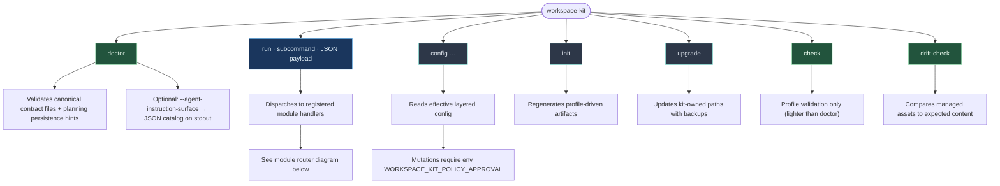
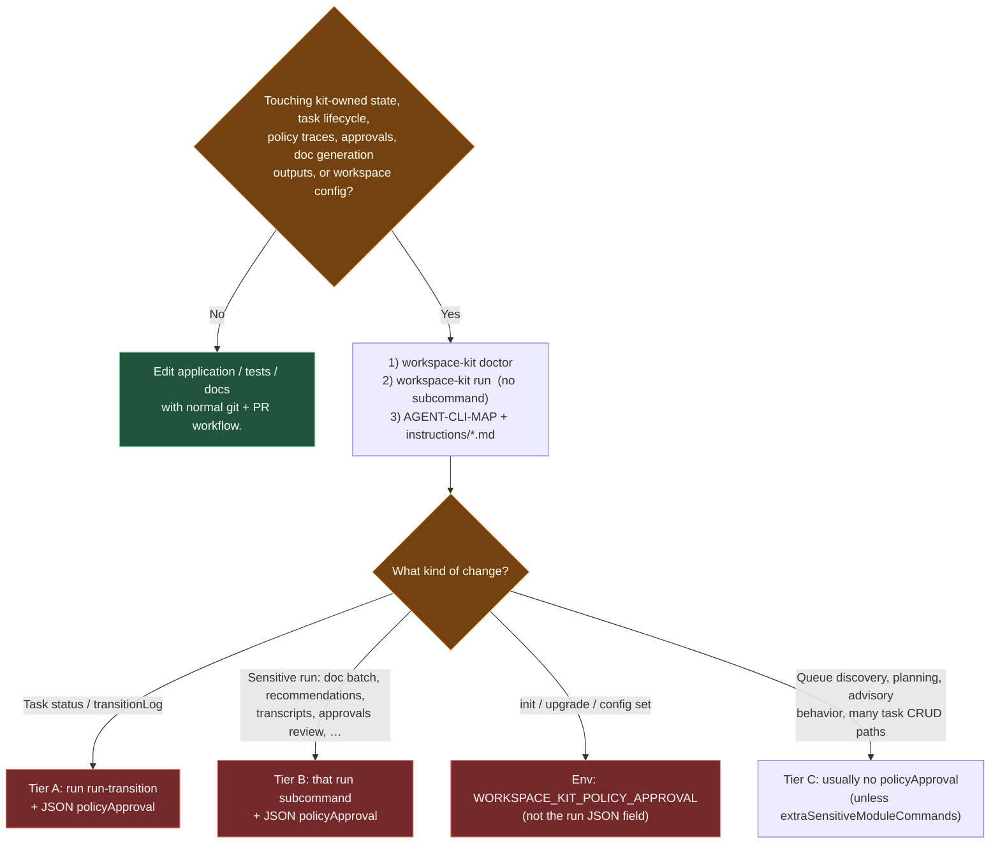
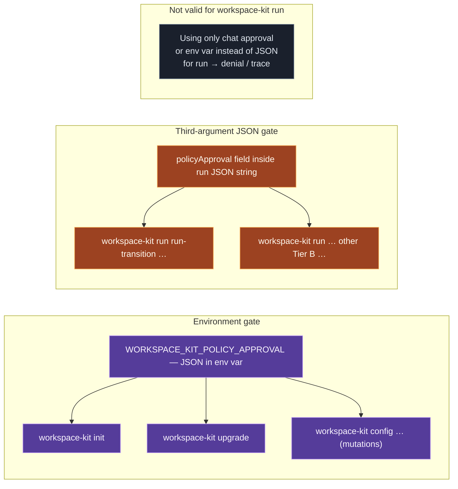
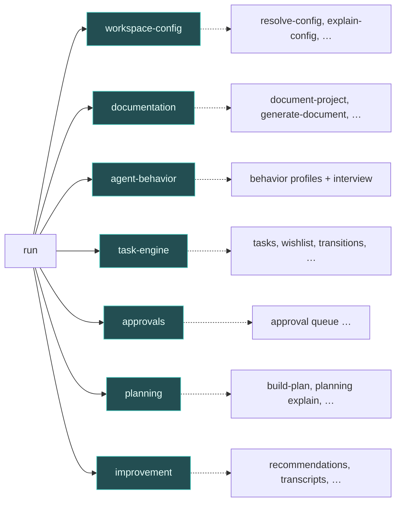

# Workspace Kit CLI — visual guide

Human-first map of **`workspace-kit`** (`@workflow-cannon/workspace-kit`): **what exists**, **when to use it**, and **which approval lane** applies. For copy-paste invocations and tier tables, keep **`AGENT-CLI-MAP.md`** as the detailed reference; for approval law, see **`POLICY-APPROVAL.md`**.

> **Mermaid diagrams** below render on GitHub and many Markdown viewers. Raw **ASCII** is readable anywhere (terminal, plain editors).

---

## Topology at a glance (ASCII)

```
                    workspace-kit
                          │
    ┌─────────────────────┼─────────────────────┐
    │                     │                     │
  doctor                  run                  config
  (health +               │                 (get/set/list/…
   optional JSON           │                  effective config)
   catalog)                │
    │                     │
    │            ┌──────────┴──────────┐
    │            │  Module command     │
    │            │  router: one JSON   │
    │            │  payload per call     │
    │            └──────────┬──────────┘
    │                       │
    │     workspace-config • documentation • agent-behavior
    │     task-engine • approvals • planning • improvement
    │
 init ───────── upgrade ───────── check ───────── drift-check
 (profile         (kit-owned       (profile        (managed
  artifacts)       paths +          shape only)    assets vs
                   backups)                        expected)
```

**Invocation shape (the part everyone trips on):**

```bash
workspace-kit run <subcommand> '<single-json-object>'
#                    ^^^^^^^^^    ^^^^^^^^^^^^^^^^^^^
#                    router      third argv = entire payload (often policyApproval here)
```

List executable subcommands (depends on enabled modules):

```bash
workspace-kit run
```

---

## Top-level commands (flow)



---

## When should the agent reach for the CLI? (decision)



**Editor `/qt` reminder:** templates under `tasks/*.md` do **not** execute the CLI. If a step persists kit state, the agent must run the matching **`workspace-kit`** line from **`AGENT-CLI-MAP.md`** (or the module instruction file).

---

## Approval lanes (two doors — do not mix them)



**Wrong-lane recovery:** If you exported **`WORKSPACE_KIT_POLICY_APPROVAL`** but invoked **`workspace-kit run …`** without **`policyApproval`** in the JSON string, the denial JSON explains that the env gate does not apply to `run`. Fix: pass `policyApproval` in the third argument, or use **`init` / `upgrade` / `config`** for env-based approval — see [`POLICY-APPROVAL.md`](./POLICY-APPROVAL.md#two-approval-surfaces-do-not-mix-them-up).

---

## `workspace-kit run` — default module bundle (router order)

Registration order from `defaultRegistryModules` (affects merge / discovery; not every module owns `run` commands):



Exact subcommand names and JSON fields: **`workspace-kit run`** (no args) and per-module **`src/modules/<module>/instructions/<command>.md`**.

---

## Session opener (habit, Tier C)

```bash
workspace-kit doctor
workspace-kit run get-next-actions '{}'
# optional: workspace-kit run get-task '{"taskId":"T###"}'
```

---

## Canonical links

| Need | Doc |
| --- | --- |
| Tier tables + copy-paste | [`AGENT-CLI-MAP.md`](./AGENT-CLI-MAP.md) |
| Approval semantics | [`POLICY-APPROVAL.md`](./POLICY-APPROVAL.md) |
| Agent operating rules | [`AGENTS.md`](./AGENTS.md) |
| System architecture | [`ARCHITECTURE.md`](./ARCHITECTURE.md) |
| Terminology | [`TERMS.md`](./TERMS.md) |
