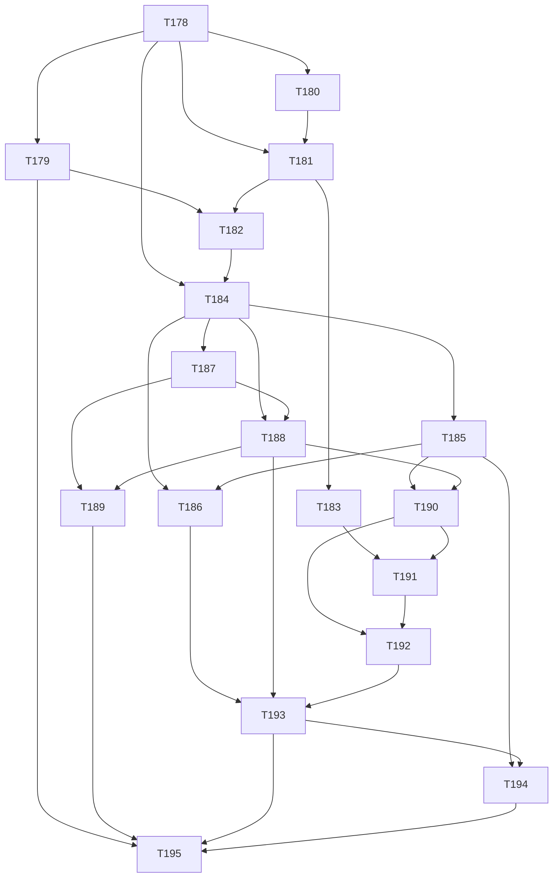

# Task Dependency Map

Canonical dependency view for `T178` through `T195`, derived from `docs/maintainers/TASKS.md`.

## Purpose

- Provide a machine-readable planning view for sequencing.
- Highlight cross-phase blockers and critical paths.
- Make release-phase readiness easier to review.

## Phase-to-release map

| Phase | Release target | Tasks |
| --- | --- | --- |
| Phase 0 | `v0.2.0` | `T178`, `T179`, `T180`, `T181`, `T182`, `T183` |
| Phase 1 | `v0.3.0` | `T184`, `T185`, `T186` |
| Phase 2 | `v0.4.0` | `T187`, `T188`, `T189` |
| Phase 3 | `v0.5.0` | `T190`, `T191`, `T192` |
| Phase 4 | `v0.6.0` | `T193`, `T194`, `T195` |

## DAG (Mermaid)

## Topological execution order (one valid order)

1. `T178`
2. `T179`, `T180`
3. `T181`
4. `T182`, `T183`
5. `T184`
6. `T185`, `T187`
7. `T186`, `T188`
8. `T189`, `T190`
9. `T191`
10. `T192`
11. `T193`
12. `T194`
13. `T195`

## Critical path to final phase-release gate

Longest dependency chain ending at `T195`:

`T178` -> `T184` -> `T187` -> `T188` -> `T190` -> `T191` -> `T192` -> `T193` -> `T194` -> `T195`

## Maintenance rule

When any `Depends on` or `Unblocks` field changes in `docs/maintainers/TASKS.md`, update this file in the same PR.
